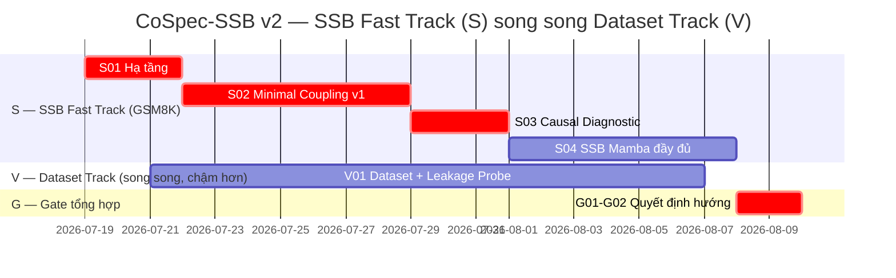

# Kế Hoạch Thực Nghiệm CoSpec-SSB v2 — SSB Trước, Dataset Song Song

**Bắt đầu:** Chủ nhật, 19/07/2026
**Repo:** `D:\Program\Dual LLMs\gsm8k-dual-agent-finetune`
**Thay đổi so với bản trước:** Đảo thứ tự — xây prototype SSB tối giản **ngay trên GSM8K + adapter D11.0 có sẵn** để có tín hiệu kỹ thuật nhanh nhất, dataset split-view (V01) chạy **song song ở ưu tiên thấp hơn**, chỉ dồn lực đầy đủ nếu SSB cho tín hiệu tốt.

---

## 0. Logic Sequencing Mới — Vì Sao Đảo Được Thứ Tự

Có hai việc tách biệt, trước đây bị gộp chung một cách bảo thủ:

| Việc | Cần dataset mới không? | Track |
|---|---|---|
| SSB có **build được** không — hook đúng layer, gradient flow đúng, causal test (shuffle/zero) có phát hiện được tín hiệu gì không | **Không** — dùng ngay GSM8K + adapter D11.0 | **S — Fast Track** |
| Chứng minh gain đến từ **genuine communication**, không phải ceiling effect/contamination của GSM8K | **Có** — cần dataset forced-cooperation | **V — Dataset Track** |

**Rủi ro đã chấp nhận:** nếu SSB không có tín hiệu gì trên GSM8K, không biết chắc là do kiến trúc dở hay do GSM8K quá dễ (ceiling effect che mất signal). Đổi lại: có prototype chạy được trong ~2 tuần thay vì ~4 tuần, và nếu **có** tín hiệu rõ trên GSM8K, đó là bằng chứng rất mạnh (vì GSM8K là điều kiện khó hơn cho SSB thắng — nếu thắng được ở đây thì gần như chắc thắng trên dataset ép buộc cộng tác).

**Gate quan trọng nhất của kế hoạch này là S03-04** — quyết định đi tiếp lên Mamba SSB đầy đủ (S04) hay quay lại điều chỉnh kiến trúc trước khi tốn công.

---

## 1. Chú giải

- 🔴 Gấp · 🟡 Cần · 🟢 Bonus
- Mã nhóm: `S` = SSB Fast Track (trên GSM8K), `V` = split-View Dataset Track (song song), `G` = Gate/tổng hợp cuối (kết hợp cả 2 track)

---

## 2. Nhóm S01 — Hạ Tầng Cho SSB Prototype

| Mã task | Tên task | Mô tả chi tiết | Công cụ gợi ý | Đường dẫn làm việc | Ưu tiên | Deadline |
|---|---|---|---|---|---|---|
| S01-01 | Kiểm tra & phục hồi adapter D11.0 | Theo ghi chú trong `D12_0_voting_report.md`, file adapter D11.0 gốc từng bị lỗi cắt cụt (768KB/1MB) và phải retrain lại 1 Round Alternating. Kiểm tra xem adapter đã retrain ở D12.0 (`outputs/adapters/agent_A_round_1`, `agent_B_round_1`) có load được bằng PEFT không. Nếu có → dùng luôn làm điểm khởi đầu cho SSB. Nếu không → chạy lại `train_alternating_lora.py` 1 Round trước khi làm gì khác. | `peft.PeftModel.from_pretrained()` để test load | `scripts/S01_verify_adapter_loadable.py` | 🔴 Gấp | 19/07/2026 |
| S01-02 | Cài đặt & test `mamba-ssm` | Cài `mamba-ssm >= 2.0.3`, chạy forward pass tối giản qua 1 Mamba block để xác nhận Triton kernel hoạt động trên GPU hiện có. Cần gấp hơn bản kế hoạch trước vì giờ dùng ngay ở S04. | `pip install mamba-ssm --break-system-packages` | `scripts/S01_test_mamba_forward_smoke.py` | 🔴 Gấp | 20/07/2026 |
| S01-03 | Xác định layer hook point cho A và B | Qwen2.5-1.5B có 28 decoder layers. Chọn thử nghiệm layer trích xuất ở Agent A (`l_A`) và layer tiêm ở Agent B (`l_B`) — khởi điểm đề xuất `l_A = l_B = 14` (giữa stack, theo cơ sở mechanistic interpretability đã nêu trong đề xuất CoSpec-SSB Mục 2.1). Viết `forward_hook` bằng `register_forward_hook` để lấy `hidden_states` tại layer này mà không cần sửa code gốc của Qwen. | `torch.nn.Module.register_forward_hook` | `src/S01_hook_utils.py` | 🔴 Gấp | 20/07/2026 |
| S01-04 | Setup single-machine sequential simulation | Vì đây là prototype nhanh trên 1 máy (chưa cần 2 server thật), viết wrapper load A → forward → lưu hidden state → giải phóng VRAM (`clear_model`) → load B → inject → forward, tương tự cách D11.0/D12.0 đã chạy tuần tự để tránh tràn VRAM. Đây LÀ cách chạy chính cho toàn bộ track S — không cần RPC/multiprocessing thật ở giai đoạn prototype. | Tái dùng `clear_model()` có sẵn trong codebase | `src/S01_sequential_runner.py` | 🟡 Cần | 21/07/2026 |

---

## 3. Nhóm S02 — Minimal Latent Coupling v1 (Linear, Chưa Cần Mamba) Trên GSM8K

> Mục tiêu: phiên bản **đơn giản nhất có thể** của kênh latent — mean-pooling + linear projection + gate — để có kết quả nhanh nhất, trước khi đầu tư công sức vào Mamba thật (S04).

| Mã task | Tên task | Mô tả chi tiết | Công cụ gợi ý | Đường dẫn làm việc | Ưu tiên | Deadline |
|---|---|---|---|---|---|---|
| S02-01 | Viết Write Encoder tối giản | Trích `H_A` (hidden states tại `l_A`, hook đã có ở S01-03) từ toàn bộ chuỗi input của Agent A, mean-pool qua chiều thời gian → 1 vector duy nhất → qua 1 `nn.Linear(d_model, d_bottleneck)`. Đề xuất `d_bottleneck = 64` cho v1 (nhỏ, dễ debug). Đây CHƯA phải SSB — chỉ là phép chiếu tuyến tính đơn giản để kiểm tra pipeline chạy được trước. | `torch.nn.Linear`, `torch.mean(dim=1)` | `src/S02_minimal_coupling.py` (class `LinearProjectionBridge`) | 🔴 Gấp | 22/07/2026 |
| S02-02 | Viết Gated Residual Injection tối giản | Chiếu vector `z` (output S02-01) ngược lại `d_model` qua `nn.Linear(d_bottleneck, d_model)`, kết hợp với hidden state của Agent B tại layer `l_B` qua 1 gate học được: `h_B_new = h_B + sigmoid(gate(h_B, z_proj)) * z_proj`. Dùng `register_forward_pre_hook` hoặc custom forward wrapper để chèn vào đúng layer `l_B` trước khi layer đó tiếp tục xử lý. | `torch.nn.Sigmoid`, forward hook chèn giá trị | `src/S02_minimal_coupling.py` (class `GatedInjection`) | 🔴 Gấp | 23/07/2026 |
| S02-03 | Ghép nối end-to-end, test forward 1 mẫu | Chạy thử pipeline: A forward (extract z) → B forward (inject z) → output, trên đúng 1 mẫu GSM8K, kiểm tra không lỗi shape, không lỗi NaN, gradient chảy được qua `loss.backward()` (test bằng `z.requires_grad` và kiểm tra `.grad` không None sau backward). | `torch.autograd`, print shape debug | `scripts/S02_test_forward_single_example.py` | 🔴 Gấp | 24/07/2026 |
| S02-04 | Viết training loop | LoRA cho cả A và B (khởi tạo từ adapter D11.0 đã verify ở S01-01, hoặc train từ đầu nếu muốn sạch), cộng thêm tham số của `LinearProjectionBridge` + `GatedInjection` (đều trainable, không LoRA vì đã nhỏ). Loss = SFT cross-entropy chỉ trên output cuối của B trước (đơn giản hoá, chưa cần multi-objective phức tạp của đề xuất gốc). | `peft`, `transformers.Trainer` hoặc custom loop | `scripts/S02_train_minimal_coupling.py`, `configs/s02_minimal_coupling_gsm8k.yaml` | 🟡 Cần | 25/07/2026 |
| S02-05 | Smoke test trên 20 mẫu | Chạy training loop trên 20 mẫu GSM8K train (không phải test!) để phát hiện lỗi sớm trước khi chạy full. Kiểm tra loss có giảm không sau vài chục step. | — | `outputs/S02_minimal_coupling_gsm8k/smoke_test_log.txt` | 🟡 Cần | 26/07/2026 |
| S02-06 | Train full trên GSM8K train split | Chạy training đầy đủ trên tập train GSM8K hiện có (tái dùng `data/raw/train.jsonl`, đảm bảo `reject_test_split_for_training()` như quy tắc cũ). | GPU sẵn có | `outputs/S02_minimal_coupling_gsm8k/adapters/`, `outputs/S02_minimal_coupling_gsm8k/bridge_weights.pt` | 🟡 Cần | 27/07/2026 |
| S02-07 | Eval trên 100 mẫu test (first_n=100, seed=42) | Eval theo đúng convention cũ để so sánh trực tiếp: `agent_A_alone`, `agent_B_alone`, `minimal_coupling_accuracy`. Đây là **con số đầu tiên** cho biết kênh latent tối giản có hoạt động gì không, so với D11.0 text pipeline (0.68). | Tái dùng `src/evaluation.py` | `outputs/S02_minimal_coupling_gsm8k/metrics/eval_metrics.json` | 🔴 Gấp | 28/07/2026 |

---

## 4. Nhóm S03 — Causal Diagnostic Protocol Trên Minimal Coupling v1

> Đây là bước quyết định nhanh: có tín hiệu communication thật hay không, trước khi đầu tư vào Mamba.

| Mã task | Tên task | Mô tả chi tiết | Công cụ gợi ý | Đường dẫn làm việc | Ưu tiên | Deadline |
|---|---|---|---|---|---|---|
| S03-01 | Shuffle test | Hoán vị vector `z` giữa các mẫu trong cùng batch test (mẫu thứ `i` nhận `z` của mẫu thứ `j ≠ i`) trước khi inject vào B, eval lại accuracy. So sánh với `minimal_coupling_accuracy` gốc ở S02-07. | Python `random.permutation`, tái dùng eval script | `scripts/S03_shuffle_test.py` | 🔴 Gấp | 29/07/2026 |
| S03-02 | Zero test | Set `z = 0` (vector không), eval lại accuracy — đo baseline "không giao tiếp gì cả" trong chính kiến trúc này (khác với B alone vì gate/injection module vẫn tồn tại nhưng nhận tín hiệu rỗng). | Tái dùng eval script, sửa 1 dòng set z=0 | `scripts/S03_zero_test.py` | 🔴 Gấp | 29/07/2026 |
| S03-03 | Noise test | Thay `z` bằng nhiễu Gaussian cùng mean/variance đo được từ tập z thật, eval lại. | `torch.randn` scaled theo `z.std()` | `scripts/S03_noise_test.py` | 🟡 Cần | 30/07/2026 |
| S03-04 | Tổng hợp verdict & quyết định Gate S04 | Tính `Δ_shuffle = Acc_matched − Acc_shuffled`, `Δ_zero = Acc_matched − Acc_zero`. **Tiêu chí đi tiếp lên S04 (Mamba SSB):** `Δ_shuffle > 10%` HOẶC `Δ_zero > 10%` (ngưỡng hạ so với đề xuất gốc 15% vì đây là bản linear tối giản, kỳ vọng thấp hơn SSB đầy đủ). Nếu không đạt ngưỡng nhưng `minimal_coupling_accuracy` vẫn xấp xỉ hoặc thấp hơn text baseline → **dấu hiệu cảnh báo**: có thể ceiling effect của GSM8K đang che tín hiệu, cần cân nhắc đẩy nhanh track V (dataset) thay vì tiếp tục đầu tư track S trên GSM8K. | Phân tích thủ công | `notes/S03_causal_diagnostic_verdict.md` | 🔴 Gấp | 31/07/2026 |

---

## 5. Nhóm S04 — Nâng Cấp Lên SSB Thật (Mamba-based) Trên GSM8K

> **Điều kiện thực hiện:** chỉ làm nhóm này nếu S03-04 cho verdict tích cực (có tín hiệu causal rõ). Nếu không, dừng lại và ưu tiên hoàn thiện track V trước khi quyết định hướng kiến trúc tiếp theo.

| Mã task | Tên task | Mô tả chi tiết | Công cụ gợi ý | Đường dẫn làm việc | Ưu tiên | Deadline |
|---|---|---|---|---|---|---|
| S04-01 | Thay Linear Projection bằng Mamba block nhỏ | Thay `LinearProjectionBridge` (S02-01) bằng 1 Mamba block (`d_state` nhỏ, ví dụ 64), input là toàn bộ chuỗi `H_A` (không mean-pool trước) — để tận dụng đúng khả năng "chọn lọc theo thời gian" mà bản linear không có. | `mamba_ssm.Mamba` class | `src/S04_ssb_mamba.py` (class `MambaWriteEncoder`) | 🟡 Cần | 01/08/2026 |
| S04-02 | Thêm K-slot pooling qua Mamba | Nén output Mamba (chuỗi dài `T_A`) thành `K` slot cố định (đề xuất K=16) — có thể dùng strided pooling đơn giản trên output Mamba trước, chưa cần cross-attention GQA phức tạp của bản đề xuất gốc (để giữ tối giản ở v1 của track này). | — | `src/S04_ssb_mamba.py` (hàm `pool_to_k_slots`) | 🟡 Cần | 02/08/2026 |
| S04-03 | Cập nhật Reader/Gate dùng K slots | Sửa `GatedInjection` (S02-02) để đọc từ `K` slot thay vì 1 vector duy nhất — dùng cross-attention đơn giản (query từ `h_B`, key/value từ K slots) thay vì nối trực tiếp. | `torch.nn.MultiheadAttention` (đơn giản hoá GQA) | `src/S04_ssb_mamba.py` (class `SimpleReader`) | 🟡 Cần | 03/08/2026 |
| S04-04 | Train SSB v1 (Mamba) trên GSM8K, so với Minimal Coupling | Train lại full pipeline với Mamba bus thay linear bridge, cùng data/config với S02 để so sánh công bằng. | Tái dùng `scripts/S02_train_minimal_coupling.py`, parameterize bridge type | `outputs/S04_ssb_mamba_gsm8k/adapters/`, `configs/s04_ssb_mamba_gsm8k.yaml` | 🟡 Cần | 05/08/2026 |
| S04-05 | Lặp lại Causal Diagnostic Protocol (S03) trên SSB Mamba | Chạy lại shuffle/zero/noise test (tái dùng script S03) trên model Mamba mới, so sánh `Δ_shuffle`, `Δ_zero` với bản linear — kỳ vọng Mamba cho tín hiệu rõ hơn nếu tính "chọn lọc theo thời gian" thực sự có giá trị. | Tái dùng `scripts/S03_*.py` | `outputs/S04_ssb_mamba_gsm8k/metrics/causal_diagnostic.json` | 🟡 Cần | 06/08/2026 |
| S04-06 | Viết note so sánh 3 phương pháp trên GSM8K | Tổng hợp bảng: Text pipeline (D11.0, 0.68) vs Minimal Coupling linear (S02) vs SSB Mamba (S04) — accuracy, Δ_shuffle, Δ_zero, độ phức tạp cài đặt. Đây là bằng chứng kỹ thuật ban đầu để quyết định có đáng đầu tư dataset mới hay không. | Markdown | `notes/S04_ssb_vs_baselines_gsm8k_report.md` | 🔴 Gấp | 07/08/2026 |

---

## 6. Nhóm V01 — Split-View Dataset Generator + Leakage Probe (Song Song, Ưu Tiên Thấp Hơn)

> Chạy song song với track S, bắt đầu từ 21/07 nhưng nhịp độ chậm hơn — không chặn tiến độ track S. Nội dung task giống bản kế hoạch trước, chỉ đổi mã và hạ ưu tiên tổng thể (trừ leakage probe gate vẫn Gấp vì đó là điều kiện tiên quyết khi cần dùng đến).

| Mã task | Tên task | Mô tả chi tiết | Công cụ gợi ý | Đường dẫn làm việc | Ưu tiên | Deadline |
|---|---|---|---|---|---|---|
| V01-01 | Thiết kế schema bài toán CSP tổng hợp | Thiết kế dạng "N thực thể × N thuộc tính" (kiểu ZebraLogic đơn giản hoá), tách rõ thuộc tính định tính (view A) và định lượng (view B), có luật ràng buộc đảm bảo nghiệm duy nhất. N khởi điểm đề xuất 3–4. | Viết tay/markdown | `notes/V01_csp_schema_design.md` | 🟡 Cần | 21/07/2026 |
| V01-02 | Viết generator sinh bài toán CSP | Hàm `generate_csp_problem(seed, n_entities)`, giải bằng backtracking/constraint solver nội bộ để đảm bảo đúng 1 nghiệm trước khi lưu. | `python-constraint` hoặc backtracking tự viết | `src/V01_csp_generator.py` | 🟡 Cần | 23/07/2026 |
| V01-03 | Viết Split-View Formatter | Hàm `format_split_view(problem)` → `(X_A, X_B)`, mask số cho A, mask thực thể cho B. | Regex, string templating | `src/V01_split_view_formatter.py` | 🟡 Cần | 24/07/2026 |
| V01-04 | Sinh thử 20 mẫu, review thủ công | Kiểm tra đề bài có nghĩa, nghiệm duy nhất, mask đọc hiểu được. | Đọc thủ công | `data/raw/V01_sample_review_20.jsonl` | 🟡 Cần | 26/07/2026 |
| V01-05 | Leakage Probe cho X_A | Logistic regression / TF-IDF dự đoán gold answer chỉ từ `X_A`. | `scikit-learn` | `scripts/V01_leakage_probe_view_a.py` | 🟡 Cần | 28/07/2026 |
| V01-06 | Leakage Probe cho X_B | Tương tự V01-05 cho `X_B`, tái dùng chung utils. | `scikit-learn` | `scripts/V01_leakage_probe_view_b.py`, `src/V01_leakage_probe_utils.py` | 🟡 Cần | 30/07/2026 |
| V01-07 | Chạy leakage probe, xác định gate pass/fail | Tiêu chí pass: `Acc_probe < Acc_random + 3%` cho cả 2 view. Lặp lại với V01-01/V01-03 nếu fail. **Đây là gate bắt buộc trước khi track V được dùng làm bằng chứng chính thức**, dù không chặn track S. | `scikit-learn` | `outputs/V01_split_view_dataset/metrics/leakage_probe_results.json` | 🔴 Gấp | 01/08/2026 |
| V01-08 | Scale sinh dataset đầy đủ | 800 train / 100 dev / 100 test, seed=42, áp dụng lại `reject_train_split_for_final_eval`/`record_sampled_ids`. | Python | `data/raw/V01_split_view_train.jsonl`, `.../dev.jsonl`, `.../test.jsonl` | 🟡 Cần | 04/08/2026 |
| V01-09 | Viết note tổng kết dataset | Số liệu từng split, kết quả leakage probe, ví dụ minh hoạ đầy đủ. | Markdown | `notes/V01_split_view_dataset_results.md` | 🟡 Cần | 06/08/2026 |

---

## 7. Nhóm G — Gate Tổng Hợp & Bước Tiếp Theo (Kết Hợp Cả 2 Track)

> Nhóm này chỉ lên kế hoạch ở mức tổng quan — chi tiết hoá cụ thể sau khi có kết quả thật từ S04-06 và V01-09, vì hướng đi phụ thuộc trực tiếp vào 2 kết quả đó.

| Mã task | Tên task | Mô tả chi tiết | Công cụ gợi ý | Đường dẫn làm việc | Ưu tiên | Deadline |
|---|---|---|---|---|---|---|
| G01 | Đối chiếu kết quả 2 track, quyết định hướng | Nếu SSB (S04) có tín hiệu causal rõ trên GSM8K **và** dataset (V01) đã pass leakage gate → triển khai ngay SSB đầy đủ trên dataset split-view (kết hợp 2 track, không cần làm lại từ Minimal Coupling). Nếu SSB không có tín hiệu trên GSM8K nhưng dataset đã sẵn sàng → thử lại SSB trực tiếp trên dataset split-view trước khi kết luận kiến trúc thất bại (vì ceiling effect của GSM8K có thể là nguyên nhân, không phải kiến trúc). Nếu cả 2 đều chưa xong đúng hạn → gia hạn track chậm hơn, không cắt góc. | Phân tích thủ công dựa trên S04-06 + V01-09 | `notes/G01_gate_decision_and_next_steps.md` | 🔴 Gấp | 08/08/2026 |
| G02 | Lên kế hoạch task chi tiết cho giai đoạn kế tiếp | Dựa trên quyết định G01, soạn bảng task mới (theo đúng format này) cho giai đoạn tiếp theo — có thể là "SSB đầy đủ + B-TBB baseline trên split-view data" (Phase 3 của đề xuất gốc) hoặc "điều chỉnh kiến trúc SSB" nếu G01 cho tín hiệu tiêu cực. | — | `notes/G02_next_phase_task_plan.md` (soạn ở đợt sau) | 🟡 Cần | 09/08/2026 |

---

## 8. Timeline Tổng Quan

**Điểm mấu chốt cần theo dõi:** `S03-04` (31/07) là gate quyết định nhanh có nên tiếp tục đầu tư Mamba (S04) hay không — nếu tín hiệu yếu, nên **dồn lực sang track V** ngay thay vì cố nâng cấp kiến trúc trên nền dataset có thể đang che tín hiệu.
