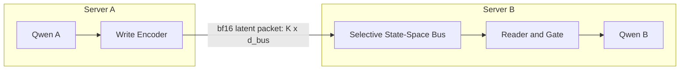

# CoSpec-SSB v3 — Tài Liệu Chuẩn Bị Nghiên Cứu

## Role-Specialized Dual Language Models Coupled through a Selective State-Space Communication Bus

**Tác giả:** Lê Vân Anh
**Phiên bản:** v3.0 — Tài liệu làm việc nội bộ (Research Preparation Document)
**Mục đích tài liệu:** Đây **không phải** bản thảo để nộp — đây là tài liệu định hướng, kế hoạch, nội dung và tài liệu tham khảo để chuẩn bị triển khai nghiên cứu. Mọi công thức, protocol, threshold trong tài liệu này là **giả thuyết làm việc (working hypotheses)** cần được thực nghiệm xác nhận hoặc bác bỏ — không phải kết quả đã có.
**Mục tiêu venue:** NeurIPS / ICML / ACL — nghiên cứu phải đạt độ chặt chẽ phương pháp luận tương đương bài báo A*.

---

## 0. Ghi Chú Về Những Gì Đã Thay Đổi So Với v2

Tài liệu này giải quyết 8 lỗ hổng được xác định qua review nội bộ trên bản v2:

| # | Vấn đề ở v2 | Giải pháp trong v3 |
|---|---|---|
| 1 | Thiếu Related Work — không định vị rõ so với Perceiver, Coconut, DIAL, Mixture-of-Agents | Thêm Mục 3 — Related Work với bảng so sánh tường minh + baseline mới B-transformer-bus |
| 2 | Mơ hồ thời điểm giao tiếp (write/read timing), đặc biệt "bidirectional" chưa giải thích được cơ chế đồng bộ | Mục 7.3 tách rõ 2 chế độ: One-shot Prefill Injection (v1, chính) vs. K-round Iterative Exchange (v2, extension nối với D11.0) |
| 3 | Baseline B1/B2 không nói rõ input visibility → so sánh có thể là strawman | Mục 12.1 nêu rõ input-visibility cho từng baseline + bảng ngân sách tham số tường minh |
| 4 | $\mathcal{L}_{\text{capacity}}$, $\mathcal{L}_{\text{gate}}$ thiếu công thức | Mục 8.6 bổ sung công thức đầy đủ |
| 5 | Leakage check chỉ định tính | Mục 11.4 — Leakage Probe Protocol định lượng |
| 6 | Thiếu kiểm định thống kê | Mục 13.3 — Statistical Testing Protocol |
| 7 | Lý do chọn Mamba còn cảm tính, thiếu cơ sở lý thuyết | Mục 8.7 — khung Information Bottleneck |
| 8 | Chưa khai thác lợi thế mở rộng N-model | Mục 5.3 — N-model generalization argument |

---

## 1. Tóm Tắt

Các hệ LLM đa tác tử hiện nay chủ yếu giao tiếp qua văn bản, prompt hoặc tool call. Những cơ chế này không buộc các mô hình học vai trò bổ sung thực sự, có chi phí token/latency cao, và khó xác minh liệu kết quả có đến từ trao đổi thông tin hay chỉ là ensemble/prompting.

Đề xuất này trình bày **CoSpec-SSB**: hai Qwen2.5-1.5B được fine-tune như hai thành phần neural riêng biệt, kết nối qua một **Selective State-Space Bus (SSB)** dựa trên Mamba. Model gửi (A) ghi một chuỗi latent control signals vào SSB; SSB nén và duy trì một communication state có tính chọn lọc theo thời gian; model nhận (B) đọc state này có điều kiện (query-conditioned) rồi tiêm thông tin vào residual stream của chính nó qua gate học được.

Nghiên cứu kiểm tra liệu hai small language model có thể học **functional specialization nội sinh** — không gán vai trò qua prompt mà qua training objective bất đối xứng — và liệu kênh latent có bộ nhớ (SSB) có tạo giá trị vượt trội so với text pipeline, latent projection đơn giản, **và một bottleneck transformer không có tính chọn lọc theo thời gian** (baseline mới, xem Mục 3). Mục tiêu trung tâm là chứng minh **causal communication** bằng can thiệp (shuffle/zero/noise/role-swap), không chỉ báo cáo accuracy.

---

## 2. Bối Cảnh và Vấn Đề

### 2.1 Hạn chế của prompting

Pipeline A-to-B qua prompt (D11.0, Alternating LoRA, đạt 0.68 trên GSM8K) đã chứng minh hai model **có thể cộng tác ở mức hành vi**. Nhưng kết quả này chưa trả lời:

1. Model A có học năng lực khác model B, hay chỉ tạo text mà B có thể tự sinh?
2. Model B có thực sự dùng thông tin từ A, hay chỉ tự giải quyết nhiệm vụ?
3. Text có phải kênh hiệu quả nhất, hay hidden representation nén truyền tốt hơn?

Prompting không thay đổi kiến trúc hay biểu diễn nội tại — hai model vẫn là hai generalist LLM giống nhau, khác instruction. Prompting phải giữ vai trò **baseline quan trọng**, không phải phương pháp chính.

### 2.2 Hạn chế của text communication

- Ép hidden representation liên tục thành token rời rạc (information bottleneck cưỡng bức, không học được).
- Cần decode ở A, network transfer, encode lại ở B → overhead token/latency.
- Không cho gradient end-to-end đi trực tiếp từ output của B về hidden state của A.

### 2.3 Cơ hội và giới hạn của latent communication

Nếu A truyền toàn bộ hidden state sang B, bandwidth/memory tăng mạnh và B có thể bị phụ thuộc quá mức hoặc lộ shortcut. Câu hỏi đúng không phải "gửi hidden state" mà:

> Làm thế nào xây dựng một kênh latent **nén, có bộ nhớ, có chọn lọc, khả vi**, để hai pretrained LLM học truyền đúng thông tin cần cho nhau — và làm sao **chứng minh** kênh đó thực sự cần thiết chứ không phải một bottleneck bất kỳ cũng làm được?

Câu hỏi thứ hai (in đậm) là trọng tâm bị thiếu ở v2 và được giải quyết ở Mục 3.

---

## 3. Related Work — Định Vị Học Thuật

Đây là phần **bắt buộc phải có** để một bài báo A* không bị bác ở vòng review đầu vì "đã có ai làm rồi".

### 3.1 Bảng so sánh với công trình gần nhất

| Công trình | Cơ chế | Điểm giống với CoSpec-SSB | Điểm khác biệt cốt lõi |
|---|---|---|---|
| **Perceiver / Perceiver-IO** (Jaegle et al., 2021) | Cross-attention pooling K latent slots từ chuỗi dài | Cũng nén chuỗi dài thành K slots cố định | Perceiver dùng cross-attention **tĩnh** (không có state phụ thuộc thời gian); SSB có $\bar{A}_t, \bar{B}_t$ input-dependent — có khả năng "quên" chọn lọc |
| **Coconut** (Hao et al., 2024) | Continuous latent thought thay token trong CoT | Truyền latent liên tục thay vì text | Coconut truyền latent **trong nội bộ 1 model** qua các bước suy luận tuần tự; SSB truyền **giữa 2 model độc lập, trên 2 tiến trình vật lý khác nhau** |
| **DIAL / CommNet** (Foerster 2016; Sukhbaatar & Fergus 2016) | Learned communication channel giữa RL agents | Cùng ý tưởng "học kênh giao tiếp" | RL-based, thường discrete/policy-gradient; SSB **differentiable end-to-end** trên LLM pretrained, không cần RL |
| **Mixture-of-Agents** (Wang et al., 2024) | Nhiều LLM layer hợp tác qua text | Multi-LLM cooperation | Text-only aggregation, không fine-tune, không có kênh latent |
| **Deep Mutual Learning** (Zhang et al., 2018) | Hai model học lẫn nhau qua KL trên output distribution | Mutual/asymmetric learning giữa 2 model | Chỉ distill **output distribution**, không có kênh latent có bộ nhớ, không có bottleneck kiểm soát được |
| **Adapter Fusion / Model Merging** (Pfeiffer et al., 2021) | Kết hợp nhiều adapter | Cả hai đều dùng tham số phụ nhỏ (LoRA-like) | Không có khái niệm "communication" giữa 2 forward pass riêng biệt — chỉ là composition tĩnh |
| **Hypernetwork sinh LoRA weights** (Various, 2023–2024) | Một network sinh tham số cho model khác | Có "điều khiển" một model từ model khác | Sinh **tham số**, không truyền **activation/state** theo từng sample |

### 3.2 Khoảng trống cụ thể (Precise Research Gap)

> Chưa có công trình nào kết hợp đồng thời: (a) hai LLM tự hồi quy pretrained, độc lập, chạy trên hai tiến trình/máy chủ khác nhau; (b) kênh giao tiếp là một **selective state-space module** có tính chọn lọc thời gian (không phải bottleneck tĩnh); (c) được huấn luyện differentiable end-to-end mà không cần RL; (d) có **protocol kiểm định nhân quả** (không chỉ accuracy) để phân biệt "cộng tác thật" khỏi ensembling/leakage.

### 3.3 Baseline bắt buộc bổ sung: Transformer Bottleneck Bus (B-TBB)

Để bảo vệ luận điểm "tính chọn lọc của Mamba có ý nghĩa" chứ không phải "bất kỳ bottleneck học được nào cũng đủ", cần một baseline **kiến trúc giống hệt SSB** (cùng K, cùng $d_{bus}$, cùng số tham số xấp xỉ) nhưng thay Mamba block bằng một **Perceiver-style Transformer bottleneck không có state phụ thuộc thời gian** (self-attention pooling tĩnh). Đây là phép so sánh apples-to-apples quan trọng nhất của bài báo — nếu SSB không thắng rõ B-TBB, toàn bộ lý do chọn Mamba (thay vì transformer) sụp đổ.

---

## 4. Câu Hỏi Nghiên Cứu

**RQ1.** Hai Qwen2.5-1.5B có thể học năng lực bổ sung qua huấn luyện end-to-end (thay vì chỉ đóng vai qua prompting) hay không?

**RQ2.** Một Selective State-Space Bus có truyền thông tin latent hiệu quả hơn text communication, direct latent projection, **và transformer bottleneck tĩnh** hay không?

**RQ3.** Khi nào hệ hai model 1.5B tiệm cận/vượt một Qwen 3B đơn lẻ **được cho xem toàn bộ thông tin**, dưới kiểm soát công bằng về tham số, FLOPs, latency, dữ liệu?

**RQ4.** Làm thế nào chứng minh model B dùng thông tin mẫu-cụ-thể của A, không phải leakage/shortcut/tự giải?

**RQ5.** Băng thông communication state, vị trí read/write, mức selectivity ảnh hưởng thế nào tới hiệu năng, ổn định, chi phí?

**RQ6 (mới).** Kiến trúc bus trung tâm có thực sự mở rộng tốt hơn kết nối pairwise khi số model tăng lên $N > 2$ hay không? *(Định hướng dài hạn — không phải trọng tâm thực nghiệm giai đoạn đầu, xem Mục 5.3)*

---

## 5. Giả Thuyết và Đóng Góp Dự Kiến

### 5.1 Giả thuyết (với ngưỡng falsifiability tường minh)

**H1 — Role specialization.** Hai Qwen cùng kiến trúc, khác adapter/objective, sẽ hình thành representation bổ sung: A = Evidence–Planning Specialist, B = Solver–Verifier Specialist.
*Ngưỡng bác bỏ:* Linear probe trên $u_t^A$ dự đoán "loại chiến lược" đạt AUC > 0.75; probe tương tự trên $u_t^B$ với cùng label đạt AUC < 0.55 (chứng minh tách biệt thông tin).

**H2 — Selective latent bus vượt trội.** SSB vượt text-only, mean-pooled latent, linear projection, **và B-TBB (Transformer Bottleneck tĩnh)** trên ít nhất một nhóm forced-cooperation task.
*Ngưỡng bác bỏ:* $\text{Acc}_{\text{SSB}} - \text{Acc}_{\text{B-TBB}} > 0.03$ với 95% CI không chứa 0 (paired bootstrap).

**H3 — Causal message dependency.** Hoán vị/zero/noise message → performance B giảm đáng kể.
*Ngưỡng bác bỏ:* $\Delta_{\text{shuffle}} > 15\%$ relative accuracy drop.

**H4 — Bandwidth–performance trade-off.** $\text{Acc}_{\text{SSB}} \gg \text{Acc}_{\text{no-comm}}$ với băng thông $K \cdot d_{bus} \ll T \cdot d_{model}$.

### 5.2 Đóng góp kiến trúc & phương pháp

1. **Selective State-Space Bus (SSB):** module Mamba độc lập giữa hai LLM, ghi/nén/nhớ/truyền latent signal.
2. **Receiver-conditioned readout:** B dùng hidden state của chính mình để truy vấn bus.
3. **Gated residual injection:** thông tin từ bus vào residual stream của B qua gate học được.
4. **Causal communication evaluation protocol:** matched/shuffled/zero/noise/role-swap/capacity-sweep — chuẩn hóa cách chứng minh "cộng tác thật" cho toàn lĩnh vực dual/multi-LLM.
5. **Controlled split-view benchmark protocol** với **leakage probe định lượng** (Mục 11.4) — không chỉ dựa vào thiết kế dữ liệu mà có công cụ đo kiểm.

### 5.3 Luận điểm mở rộng N-model (định hướng dài hạn — KHÔNG là trọng tâm thực nghiệm chính)

Kiến trúc "bus trung tâm" có lợi thế cấu trúc rõ so với kết nối pairwise: với $N$ model, một bus chia sẻ cần $O(N)$ cổng write/read, trong khi kết nối latent trực tiếp pairwise (mỗi cặp model có cross-attention riêng) cần $O(N^2)$ kết nối. Đây là lý do chiến lược để chọn kiến trúc bus ngay từ giai đoạn 2-model, dù thực nghiệm chính chỉ giới hạn ở $N=2$. Nên nêu ngắn gọn trong phần Future Work của bài báo, không mở rộng thực nghiệm ở phiên bản đầu.

---

## 6. Phạm Vi Kiến Trúc — Can Thiệp Cấp A

- Giữ nguyên toàn bộ kiến trúc lõi Qwen2.5-1.5B (không sửa attention, MLP, RoPE, GQA, tokenizer).
- Không sửa CUDA/Triton kernel của Qwen hoặc Mamba.
- Thêm Mamba-based SSB trainable **ngoài** backbone.
- Lấy hidden state ở layer đã chọn của A để **ghi**; đọc SSB ở layer đã chọn của B để **tiêm**.
- Fine-tune Qwen qua LoRA/QLoRA hoặc partial unfreezing.

SSB không sinh token, không có prompt, không được tính là agent/LLM thứ ba — chỉ là hạ tầng communication.

---

## 7. Kiến Trúc Hệ Thống

### 7.1 Sơ đồ tổng quan

```mermaid
flowchart LR
    X[Problem X] --> SPLIT[Controlled Split-View Formatter]
    SPLIT --> XA[View XA: entities, evidence, relations]
    SPLIT --> XB[View XB: quantities, constraints, target]
    XA --> A[Qwen A 1.5B<br/>Evidence and Planning Specialist]
    XB --> B[Qwen B 1.5B<br/>Solver and Verifier Specialist]
    A --> HA[Hidden states H_A at layer l_A]
    HA --> W[Write Encoder + Slot Pooling]
    W --> U[Control sequence U_A, K x d_bus]
    U --> SSB[Selective State-Space Bus<br/>Mamba-based, selective forget]
    SSB --> Z[Communication state Z]
    B --> HB[Hidden states H_B at layer l_B]
    HB --> R[Receiver-conditioned Reader]
    Z --> R
    R --> G[Coupling Gate]
    G --> I[Residual Injection]
    I --> B
    B --> Y[Final answer Y]
```

### 7.2 Thành phần

| Thành phần | Chức năng | Trainable? |
|---|---|---|
| Qwen A | Trích xuất evidence, structure, plan | Có (LoRA) |
| Qwen B | Solve, verify, tạo final answer | Có (LoRA) |
| Write encoder | Nén hidden state của A thành control sequence | Có |
| SSB | Lưu giữ và lọc latent communication | Có |
| Reader | B truy xuất thông tin từ SSB | Có |
| Coupling gate | Điều tiết mức injection vào B | Có |
| Split-view formatter | Tạo $X_A, X_B$, chống leakage | Rule-based |

### 7.3 [MỚI] Làm rõ thời điểm giao tiếp (Communication Timing) — điểm sửa quan trọng nhất

Đây là quyết định kiến trúc phải nêu **tường minh** trong bài báo, tránh mơ hồ giữa "bidirectional" và tính khả thi đồng bộ hoá thực tế:

**Chế độ chính (v1) — One-shot Prefill Injection:**
- A xử lý toàn bộ $X_A$ một lần (chỉ prefill, không cần generate token), tạo trajectory $H_A^{(l_A)}$ cố định.
- Write encoder nén thành $U_A \in \mathbb{R}^{K \times d_{bus}}$; SSB xử lý một lần thành $Z$ (cố định).
- B đọc $Z$ **một lần** trong lúc prefill của chính nó, injection diễn ra trước khi B bắt đầu decode.
- **Không có vấn đề đồng bộ hoá** vì A hoàn thành hoàn toàn trước khi B cần dùng $Z$ — đây là pipeline hai giai đoạn (two-stage), không phải streaming song song.

**Chế độ mở rộng (v2, Phase 5) — K-round Iterative Exchange:**
- Tái sử dụng trực tiếp insight đã kiểm chứng thực nghiệm ở D11.0 (Alternating LoRA A→B đạt 0.68): thay vì giao tiếp một chiều một lần, cho A và B trao đổi qua SSB **nhiều vòng tuần tự** (round $1, 2, \dots, R$), mỗi vòng là một lần prefill mới với injected state cập nhật từ vòng trước.
- Đây chính là nơi **tính chọn lọc/quên theo thời gian của Mamba mới thực sự cần thiết** — vì bus phải giữ và cập nhật thông tin qua nhiều vòng, không chỉ nén một chuỗi tĩnh một lần (khi đó một Perceiver tĩnh, không có bộ nhớ giữa các vòng, sẽ không đủ).
- Không triển khai ở Phase đầu — chỉ sau khi v1 đã có causal signal rõ ràng.

**Khuyến nghị viết bài báo:** Method chính (Section 4 của paper) chỉ mô tả v1. K-round Exchange đưa vào Section "Extensions" hoặc Future Work, có thể có thực nghiệm sơ bộ nếu thời gian cho phép — đây cũng là điểm nối liền câu chuyện với baseline D11.0 đã có, tăng tính liên tục của narrative nghiên cứu.

---

## 8. Kiến Trúc Mô Hình Chi Tiết

### 8.1 Hai model độc lập

$$M_A = \text{Qwen}_{\theta_A}, \qquad M_B = \text{Qwen}_{\theta_B}$$

28 layers, GQA 12 query heads/2 KV heads. Thử communication interface tại layer 7, 14, 21 (early/middle/late coupling).

$$H_A = M_A(X_A), \qquad H_B = M_B(X_B)$$

### 8.2 Write encoder

$$u_t^{A \to B} = W_u \cdot \text{LN}(h_{A,t}^{(l_A)}) \in \mathbb{R}^{d_{bus}}$$

Dùng strided pooling hoặc learned slot pooling để tạo $K$ vector thay vì $T_A$ vector:

$$U_A = \text{Pool}_K(H_A^{(l_A)}) \in \mathbb{R}^{K \times d_{bus}}$$

### 8.3 Selective State-Space Bus

Mamba block hoặc stack 2–4 blocks, 5M–30M tham số:

$$z_t = \bar{A}_t z_{t-1} + \bar{B}_t u_t^{A \to B}, \qquad o_t = C_t z_t$$

$\bar{A}_t, \bar{B}_t, C_t$ input-dependent (selective SSM) — bus có thể "quên" tín hiệu không quan trọng và giữ yếu tố cần cho B:

$$Z = \text{SSB}_\phi(U_A)$$

### 8.4 Receiver-conditioned reader

B không đọc trực tiếp $H_A$. Tại read layer $l_B$, B tạo query từ hidden state của chính mình:

$$q_j = W_q h_{B,j}^{(l_B)}, \qquad c_j = \text{CrossAttention}(q_j, W_k Z, W_v Z)$$

Cross-attention chỉ giữa B và **bottleneck state $Z$** — băng thông kiểm soát được, SSB là đường truyền bắt buộc.

### 8.5 Gated residual injection

$$g_j = \sigma\left(W_g[h_{B,j}^{(l_B)}; c_j] + b_g\right)$$

$$\tilde{h}_{B,j}^{(l_B)} = h_{B,j}^{(l_B)} + g_j \odot W_o c_j$$

$$\hat{Y} = \text{Qwen}^{>l_B}_{\theta_B}(\tilde{H}_B^{(l_B)})$$

### 8.6 [MỚI] Công thức đầy đủ cho $\mathcal{L}_{\text{capacity}}$ và $\mathcal{L}_{\text{gate}}$

$$\mathcal{L}_{\text{capacity}} = \frac{1}{K}\sum_{k=1}^{K} \max(0, \|z_k\|_2 - \tau)^2$$

Phạt norm của mỗi slot vượt ngưỡng $\tau$ (hyperparameter, khởi tạo $\tau = \sqrt{d_{bus}}$) — ngăn A "nhồi" quá nhiều thông tin vào một số ít slot.

$$\mathcal{L}_{\text{gate}} = -\mathbb{E}_j\left[g_j \log g_j + (1-g_j)\log(1-g_j)\right]$$

Entropy regularizer trên gate activation — phạt khi gate bão hòa về 0 (không dùng thông tin từ A — vô nghĩa về mặt kiến trúc) hoặc về 1 (luôn mở, không chọn lọc — mất khả năng diễn giải "khi nào cần A").

### 8.7 [MỚI] Cơ sở lý thuyết: khung Information Bottleneck

SSB có thể diễn giải qua lăng kính Information Bottleneck (Tishby & Zaslavsky, 2015): $\mathcal{L}_{\text{capacity}}$ đóng vai trò nén $I(Z; U_A)$ (giữ bus nhỏ, không sao chép toàn bộ input của A), trong khi $\mathcal{L}_{\text{answer}}$ gián tiếp tối đa hóa $I(Z; Y^*)$ (giữ lại phần thông tin thực sự cần cho đáp án đúng). Điều này lý giải tại sao SSB cần một cơ chế nén *có chọn lọc theo nội dung* (input-dependent) thay vì nén tuyến tính cố định — chính là lý do lựa chọn Mamba thay vì một phép chiếu tuyến tính đơn giản hoặc một Perceiver tĩnh (xem B-TBB, Mục 3.3).

---

## 9. Giao Tiếp Text và Latent — So Sánh Công Bằng

| Kênh | A gửi gì? | B nhận gì? | Ưu điểm | Hạn chế |
|---|---|---|---|---|
| Text | Evidence/plan có cấu trúc, 16–256 token | Token sequence | Diễn giải được, dễ debug | Chậm, discrete bottleneck |
| Latent-vector | Một vector/pooled state | Vector latent | Rẻ, differentiable | Có thể nghèo thông tin |
| **Transformer Bottleneck (B-TBB)** | Chuỗi K slot qua self-attention tĩnh | Bottleneck outputs | Có structure, differentiable | Không có state phụ thuộc thời gian |
| SSB latent | Chuỗi control signal nén, có state | Stateful bus outputs | Có bộ nhớ, selectivity, end-to-end | Khó diễn giải hơn |
| Hybrid text + SSB | Cả text và bus state | Hai nguồn | Linh hoạt, robust | Phức tạp hơn |

**Phương pháp chính:** SSB latent communication. **Baseline đối chứng bắt buộc:** Text (fallback nếu SSB không thắng) và B-TBB (kiểm tra "tính selective" có cần thiết). **Extension:** Hybrid — chỉ thực hiện sau khi text-only và SSB-only đã kiểm chứng.

---

## 10. Chuyên Môn Hóa Vai Trò

| Model | Vai trò quy nạp | Auxiliary supervision |
|---|---|---|
| Qwen A | Evidence–Planning Specialist | Entities, relations, constraints, subgoals, candidate plan |
| Qwen B | Solver–Verifier Specialist | Final answer, consistency label, correction/rejection |

Vai trò là **training asymmetry** khởi tạo specialization, không phải ràng buộc cứng.

$$\mathcal{L}_A = \mathcal{L}_{\text{evidence}} + \lambda_p \mathcal{L}_{\text{plan}}$$

$$\mathcal{L}_B = \mathcal{L}_{\text{answer}} + \lambda_v \mathcal{L}_{\text{verification}}$$

$$\mathcal{L}_{\text{total}} = \mathcal{L}_B + \lambda_A \mathcal{L}_A + \lambda_C \mathcal{L}_{\text{capacity}} + \lambda_G \mathcal{L}_{\text{gate}} + \lambda_D \mathcal{L}_{\text{diversity}}$$

Không ép HSIC/orthogonality quá mạnh từ đầu — nên là **analysis metric trước**, chỉ đưa vào loss nếu ablation chứng minh có lợi (tránh mất representation hữu ích, giữ khả năng diễn giải kết quả).

---

## 11. Dữ Liệu và Benchmark

### 11.1 Nguyên tắc bắt buộc — Forced Cooperation

$$\text{Acc}(M_A \mid X_A) \approx \text{Acc}_{\text{random}}, \qquad \text{Acc}(M_B \mid X_B) \approx \text{Acc}_{\text{random}}$$

$$\text{Acc}(M_A, M_B \mid X_A, X_B) \gg \text{Acc}_{\text{random}}$$

### 11.2 Dữ liệu ưu tiên

| Dataset | Vai trò | Quyết định |
|---|---|---|
| Synthetic CSP/relational tasks | Kiểm soát hoàn toàn structure, leakage, difficulty | Bắt buộc |
| Logic grid / ZebraLogic-style | Benchmark reasoning chính | Bắt buộc |
| Programmatic arithmetic-and-constraint tasks | Tạo split entities vs. quantities | Bắt buộc |
| Candidate-solution verification tasks | Phân biệt Planner và Verifier | Bắt buộc |
| BBEH hoặc reasoning dataset split hợp lệ | Generalization | Nên dùng |
| GSM8K | Benchmark phụ | Hạ ưu tiên (contamination risk cao) |

### 11.3 Split-view example

| Thông tin | View của A | View của B |
|---|---|---|
| Entity names/attributes | Có | Mask thành `ENTITY_i` |
| Semantic relations | Có | Một phần |
| Numeric values | Mask thành `NUM_i` | Có |
| Operators, bounds | Mask một phần | Có |
| Target question | Có | Có |
| Gold answer | Không | Không |

### 11.4 [MỚI] Leakage Probe Protocol — định lượng thay vì định tính

Huấn luyện một **linear probe nhỏ** (logistic regression trên frozen embedding của $X_A$/$X_B$) cố dự đoán $Y^*$ **chỉ từ** $X_A$, và một probe riêng **chỉ từ** $X_B$.

**Tiêu chí chấp nhận mẫu vào tập forced-cooperation:**
$$\text{Acc}_{\text{probe}}(X_A \to Y^*) < \text{Acc}_{\text{random}} + \epsilon, \qquad \epsilon = 3\%$$

Áp dụng tương tự cho $X_B$. Mẫu không đạt tiêu chí bị loại khỏi tập training/eval chính. Report probe accuracy như bằng chứng validation trong bài báo (bảng riêng, không chỉ nêu bằng lời).

---

## 12. Thiết Kế Thực Nghiệm

### 12.1 [MỚI] Baseline — kèm Input Visibility tường minh

| Mã | Baseline | Input visibility | Mục tiêu kiểm soát |
|---|---|---|---|
| B1 | Single Qwen2.5-1.5B | **Toàn bộ $X$ (không split)** | Lower bound |
| B2 | Single Qwen-family 3B | **Toàn bộ $X$ (không split)** | Ceiling chính cần vượt — fine-tuned trên cùng benchmark |
| B3 | Two independent Qwen1.5B + majority vote | Mỗi model thấy $X_A$/$X_B$ riêng | Loại giả thuyết ensembling |
| B4 | Prompted A-to-B text pipeline | Split | Hướng hiện tại (D11.0) |
| B5 | Fine-tuned text-only A-to-B | Split | Giá trị của trainable specialization |
| B6 | Direct pooled latent vector A-to-B | Split | Latent baseline tối giản |
| B7 | Direct cross-attention on full $H_A$ | Split | SSB có cần thiết so với full-access không bottleneck? |
| **B-TBB** | **Transformer Bottleneck (Perceiver-style, cùng K/$d_{bus}$, không selective)** | Split | **Kiểm tra: tính selective của Mamba có cần thiết, hay bottleneck bất kỳ cũng đủ?** |
| B8 | Random/frozen SSB | Split | Kiểm tra learned bus có cần thiết |
| B9 | SSB không có role objectives | Split | Kiểm tra specialization objective |
| B10 | SSB không có gate | Split | Kiểm tra selective injection |
| B11 | **Full CoSpec-SSB** | Split | Phương pháp đề xuất |

> **Lưu ý bắt buộc khi viết bài báo:** B1, B2 phải được fine-tune trên **cùng benchmark, cùng dữ liệu gốc chưa split**, không phải zero-shot — đây là phép so sánh công bằng và quan trọng nhất của toàn bộ nghiên cứu.

### 12.2 [MỚI] Ngân sách tham số — báo cáo tường minh

$$\text{Params}_{\text{CoSpec-SSB}} = \underbrace{2 \times 1.5B}_{\text{2 Qwen backbone}} + \underbrace{(5\text{–}30M)}_{\text{SSB}} + \underbrace{(\text{vài M})}_{\text{encoder+reader+gate}} \approx 3.03\text{–}3.06B$$

Nhỉnh hơn 3B một chút. Cần báo cáo **cả hai** phép so sánh: parameter-matched (B2 = đúng 3B) và compute/FLOPs-matched — không được để overhead này ẩn trong bài báo; nêu tường minh trong bảng Systems metrics.

### 12.3 Ablation kiến trúc

| Nhóm | Giá trị thử |
|---|---|
| Write layer $l_A$ | 7, 14, 21 |
| Read layer $l_B$ | 7, 14, 21 |
| Bus size $d_{bus}$ | 128, 256, 512, 1024 |
| Number of slots K | 4, 8, 16, 32 |
| SSB depth | 1, 2, 4 Mamba blocks |
| Injection | Additive, gated additive, FiLM-style |
| Bus direction | A-to-B (chính); B-to-A, K-round bidirectional (Phase 5 extension, xem Mục 7.3) |
| Trainable parts | SSB-only, LoRA+SSB, partial unfreeze+SSB |

---

## 13. Metrics và Kiểm Định Thống Kê

### 13.1 Nhóm metric

| Nhóm | Metric |
|---|---|
| Chất lượng nhiệm vụ | Accuracy, exact match, F1 tùy benchmark |
| Causal dependency | Shuffle drop, zero-message drop, noise-message drop |
| Communication efficiency | Bytes/sample, token budget, active slots, latency |
| Systems | Throughput, GPU memory, FLOPs estimate, network latency |
| Specialization | Probe accuracy, role-swap drop, task transfer |
| Leakage | Probe accuracy trên $X_A \to Y^*$ và $X_B \to Y^*$ (Mục 11.4) |

### 13.2 [MỚI] Statistical Testing Protocol

- **Paired bootstrap resampling** (10,000 resamples) trên từng benchmark item để tính 95% CI cho $\Delta_{\text{shuffle}}$, $\Delta_{\text{zero}}$, và gain so với B2/B-TBB.
- **Wilcoxon signed-rank test** cho so sánh có ghép cặp giữa CoSpec-SSB và từng baseline (không dùng t-test đơn giản vì accuracy không nhất thiết phân phối chuẩn).
- Tối thiểu **3–5 seeds** cho mọi kết quả chính; report mean ± std **và** CI từ bootstrap, không chỉ mean ± std.

---

## 14. Kiểm Định Nhân Quả

| Intervention | Cách thực hiện | Kỳ vọng |
|---|---|---|
| Matched SSB | B nhận Z từ A cùng sample | Performance cao nhất |
| Shuffled SSB | Hoán vị Z giữa samples trong batch | Accuracy giảm |
| Zero SSB | Z = 0 | Accuracy giảm |
| Noise SSB | Thay Z bằng noise cùng mean/variance | Accuracy giảm |
| Random SSB | Bus không train hoặc weights random | Không bằng full model |
| Role swap | Đổi adapter/role A và B | Accuracy giảm |
| Text replacement | Thay SSB bằng text cùng budget | So sánh trực tiếp channel |
| Capacity sweep | Giảm/tăng $K, d_{bus}$ | Trade-off hợp lý |

$$\Delta_{\text{shuffle}} = \text{Acc}_{\text{matched}} - \text{Acc}_{\text{shuffled}}, \qquad \Delta_{\text{zero}} = \text{Acc}_{\text{matched}} - \text{Acc}_{\text{zero}}$$

Nếu hai độ giảm này gần 0 → B không dùng thông tin mẫu-cụ-thể từ A; **không được claim genuine communication.**

---

## 15. Quy Trình Huấn Luyện

### Phase 0 — Reproduction và audit (1–2 tuần)
Chạy Qwen1.5B single-model baselines; xây dataset generator và leakage probe (Mục 11.4); thiết lập seed/logging/checkpointing.
**Gate:** Nếu split task không forced cooperation (leakage probe fail) → chưa được phát triển SSB.

### Phase 1 — Text A-to-B baseline (1–2 tuần)
Tái hiện pipeline A-to-B qua prompt; fine-tune text-only; sweep token budget.
**Gate:** Có baseline text ổn định để SSB phải vượt hoặc đánh đổi hợp lý.

### Phase 2 — Minimal latent coupling (1–2 tuần)
Mean-pooling/low-rank projection A→B; gated residual injection; matched/shuffled/zero/noise tests.
**Gate:** Chỉ thêm Mamba Bus nếu minimal latent path có causal signal.

### Phase 3 — CoSpec-SSB + B-TBB song song (3–5 tuần)
Train write encoder, SSB, reader, gate; **đồng thời train B-TBB (Perceiver-style) làm baseline trực tiếp** — không để đến cuối mới so sánh; LoRA cho A/B; sweep slots/dimension/coupling layers.
**Gate:** Full SSB cần vượt B4–B11 **kể cả B-TBB**, hoặc chứng minh efficiency advantage rõ rệt.

### Phase 4 — Scale và complete evaluation (3–4 tuần)
3–5 seeds; benchmark generalization; Qwen 3B comparison (fine-tuned, full-input, Mục 12.1); full causal protocol; statistical testing (Mục 13.2); compute/latency/bandwidth reporting; paper writing, code release.

### Phase 5 [MỚI, tùy chọn/extension] — K-round Iterative Exchange (2–3 tuần)
Chỉ thực hiện sau khi Phase 3–4 xác nhận causal signal rõ ràng. Triển khai chế độ v2 (Mục 7.3): trao đổi nhiều vòng qua SSB, nối trực tiếp với insight D11.0. Đây là nơi giá trị của tính "selective/quên theo thời gian" của Mamba được kiểm định mạnh nhất — so sánh SSB (có bộ nhớ giữa các vòng) với B-TBB (không có bộ nhớ, phải xử lý lại từ đầu mỗi vòng).

---

## 16. Hạ Tầng và Tính Khả Thi

| Mức | Phần cứng | Thực nghiệm |
|---|---|---|
| Tier 1 | 1× RTX 4090 24GB | Data generation, single Qwen, text baseline, tiny SSB |
| Tier 2 | 2× RTX 4090 24GB | Dual Qwen LoRA + SSB, batch nhỏ, causal tests |
| Tier 3 | 4–8× A100/H100 80GB | Multi-seed, full sweeps, context dài, fine-tuning |
| Tier 4 | Two-node cluster, 100Gbps+ interconnect | Distributed latency, real communication cost |

$$\text{Bytes} = K \cdot d_{bus} \cdot 2 \quad (\text{bf16/fp16})$$

Ví dụ $K=16, d_{bus}=512$ → 16,384 bytes/sample — nhỏ hơn đáng kể so với truyền toàn bộ hidden-state trajectory.

---

## 17. Rủi Ro và Giảm Thiểu

| Rủi ro | Ý nghĩa | Giảm thiểu |
|---|---|---|
| Không có causal communication | SSB không thực sự được B dùng | Leakage probe (11.4), shuffle/zero tests |
| Direct latent tốt bằng SSB | Mamba Bus không cần thiết | So sánh trực diện với B-TBB (3.3) |
| Text tốt hơn SSB | Latent không thắng quality | Báo cáo efficiency/latency, hybrid extension |
| Role collapse | Hai model làm cùng nhiệm vụ | Asymmetric inputs, auxiliary objectives, role-swap |
| Overfitting benchmark | Gain chỉ do synthetic artifacts | Nhiều generators, held-out templates, OOD splits |
| Compute quá lớn | Fine-tune hai Qwen khó | QLoRA/LoRA, freeze backbone, train SSB trước |
| **Bus = cross-attention trá hình** | Không có bottleneck thực sự mới | **B-TBB baseline trực tiếp giải quyết rủi ro này (đã sửa ở v3)** |
| SSB khó diễn giải | Reviewer nghi ngờ message | Capacity curve, probes, text baseline, causal interventions |
| Baseline B2 không công bằng | So sánh strawman | Input-visibility tường minh (12.1), fine-tune trên full input |
| Thiếu ý nghĩa thống kê | Kết quả có thể do nhiễu seed | Bootstrap CI + Wilcoxon (13.2) |

---

## 18. Tiêu Chí Thành Công

1. CoSpec-SSB vượt text-only, direct latent projection, ensemble, **và B-TBB** trên ít nhất hai nhóm forced-cooperation task, với $\Delta > 0.03$ và 95% CI không chứa 0.
2. Gain tồn tại với tối thiểu 3–5 seeds, kiểm định bằng Wilcoxon signed-rank ($p < 0.05$).
3. Matched SSB tốt hơn shuffled/zero/noise SSB có ý nghĩa ($\Delta_{\text{shuffle}} > 15\%$).
4. Role-swap làm giảm performance; probe cho AUC > 0.75 (A) / < 0.55 (B trên cùng label) — Mục 5.1 H1.
5. SSB có capacity curve thuyết phục — message nén vẫn hữu ích.
6. So sánh công bằng với Qwen 3B fine-tuned trên full input (parameter count, FLOPs, latency, GPU memory, network bytes — Mục 12.2).
7. Leakage probe xác nhận $X_A$ và $X_B$ riêng lẻ không giải được (Mục 11.4).
8. Toàn bộ split generator, code, seeds, configs, protocol đánh giá được phát hành.

---

## 19. Checklist Chuẩn Bị Triển Khai (Actionable Next Steps)

- [ ] Cài đặt `mamba-ssm` library, verify Triton kernel hoạt động trên GPU sẵn có
- [ ] Viết dataset generator cho synthetic CSP + logic grid (ZebraLogic-style) với split-view formatter
- [ ] Cài đặt leakage probe pipeline (Mục 11.4) — chạy trước khi bắt đầu training thật
- [ ] Setup 2-server RPC hoặc single-machine multi-process simulation (Tier 1/2 trước khi lên Tier 3/4)
- [ ] Cài đặt B-TBB (Perceiver-style baseline) **song song** với SSB — không để làm sau
- [ ] Viết script bootstrap resampling + Wilcoxon test cho toàn bộ pipeline đánh giá
- [ ] Chuẩn bị bảng tracking ngân sách tham số/FLOPs cho từng baseline (Mục 12.2)
- [ ] Đọc kỹ 3 paper nền tảng trước khi code: Mamba (Gu & Dao 2023), Mamba-2 (Dao & Gu 2024), Perceiver-IO (Jaegle 2021)

---

## 20. Tài Liệu Tham Khảo

**Selective State-Space Models:**
- Gu & Dao (2023). *Mamba: Linear-Time Sequence Modeling with Selective State Spaces*. arXiv:2312.00752.
- Dao & Gu (2024). *Transformers are SSMs: Generalized Models and Efficient Algorithms Through Structured State Space Duality* (Mamba-2). ICML. arXiv:2405.21060.

**Bottleneck / Resampling Architectures (Related Work — Mục 3):**
- Jaegle, Gimeno, Brock, Zisserman, Vinyals & Carreira (2021). *Perceiver: General Perception with Iterative Attention*. ICML.
- Jaegle et al. (2021). *Perceiver IO: A General Architecture for Structured Inputs & Outputs*. arXiv.

**Continuous Latent Reasoning:**
- Hao, Suber & Zhang (2024). *Training LLMs to Reason in a Continuous Latent Space* (Coconut). arXiv:2412.06769.
- Goyal et al. (2021). *Coordination Among Neural Modules Through a Shared Global Workspace*. ICLR 2022.

**Emergent / Learned Communication (Multi-Agent RL):**
- Foerster, Assael, de Freitas & Whiteson (2016). *Learning to Communicate with Deep MARL*. NeurIPS.
- Sukhbaatar & Fergus (2016). *Learning Multiagent Communication with Backpropagation* (CommNet). NeurIPS.
- Lazaridou & Baroni (2020). *Emergent Multi-Agent Communication in the Deep Learning Era*. Survey.

**Multi-LLM Cooperation (Text-based):**
- Wang et al. (2024). *Mixture-of-Agents Enhances Large Language Model Capabilities*. arXiv.
- Du, Li, Torralba, Tenenbaum & Mordatch (2023). *Improving Factuality and Reasoning in LLMs through Multiagent Debate*. arXiv.

**Knowledge Distillation & Mutual Learning:**
- Zhang, Xiang, Hospedales & Lu (2018). *Deep Mutual Learning*. CVPR.
- Tishby & Zaslavsky (2015). *Deep Learning and the Information Bottleneck Principle*.
- Alemi, Fischer, Dillon & Murphy (2017). *Deep Variational Information Bottleneck*. ICLR.

**Parameter-Efficient Fine-Tuning / Adapter Composition:**
- Hu et al. (2022). *LoRA: Low-Rank Adaptation of Large Language Models*. ICLR.
- Pfeiffer et al. (2021). *AdapterFusion: Non-Destructive Task Composition for Transfer Learning*. EACL.

**Statistical Testing for NLP Evaluation:**
- Dror, Baumer, Shlomov & Reichart (2018). *The Hitchhiker's Guide to Testing Statistical Significance in NLP*. ACL.

**Benchmarks:**
- Lin et al. (2024). *ZebraLogic: On the Scaling Limits of LLMs for Logical Reasoning*.
- Kazemi et al. (2025). *BIG-Bench Extra Hard* (BBEH). ACL.

**Model card:**
- Qwen Team (2024). *Qwen2.5-1.5B-Instruct*. HuggingFace. huggingface.co/Qwen/Qwen2.5-1.5B-Instruct

---

## 21. Tuyên Bố Đóng Góp (Draft)

> Chúng tôi đề xuất CoSpec-SSB, một hệ dual-LLM gồm hai Qwen2.5-1.5B chuyên môn hóa vai trò, coupled bởi một Mamba-based Selective State-Space Bus. Khác với prompting, text-only orchestration, hay bottleneck tĩnh (Perceiver-style), CoSpec-SSB học một kênh latent nén, có bộ nhớ, có chọn lọc để truyền tri thức từ model gửi sang model nhận. Chúng tôi đánh giá hệ thống bằng benchmark split-view bắt buộc hợp tác (được xác nhận qua leakage probe định lượng), một protocol can thiệp nhân quả nghiêm ngặt (shuffle/zero/noise/role-swap), và kiểm định thống kê (bootstrap CI + Wilcoxon), nhằm xác định liệu gain có thực sự đến từ communication mẫu-cụ-thể hay không — và liệu tính chọn lọc theo thời gian của kênh Mamba có tạo giá trị vượt trội so với một bottleneck tĩnh tương đương hay không.

### Quyết định thiết kế cuối (v3)

- Vẫn là Dual LLMs: hai Qwen2.5-1.5B độc lập.
- Có can thiệp kiến trúc: thêm Mamba SSB giữa hai model (can thiệp cấp A, không sửa backbone).
- Communication timing tường minh: One-shot Prefill (v1, chính) + K-round Iterative (v2, extension nối D11.0).
- Baseline B-TBB bắt buộc để cô lập đóng góp của tính "selective" (không phải "bottleneck nói chung").
- B1/B2 nhận toàn bộ input không split — so sánh công bằng với ceiling thật.
- Leakage được đo định lượng qua linear probe, không chỉ thiết kế dữ liệu định tính.
- Mọi claim gain đi kèm bootstrap CI + kiểm định ý nghĩa thống kê.
- GSM8K không phải benchmark chính — ưu tiên forced-cooperation dataset.
- Không có shuffle/zero/noise drop rõ ràng → không claim genuine communication.
