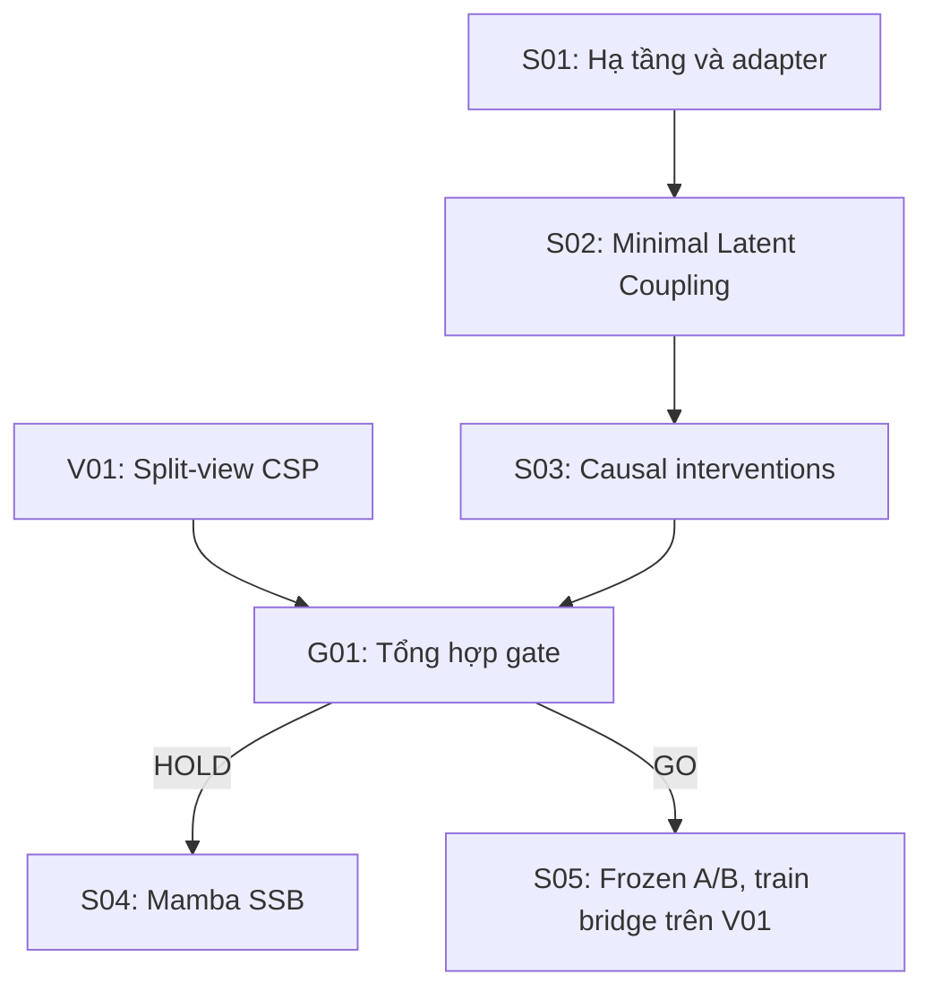
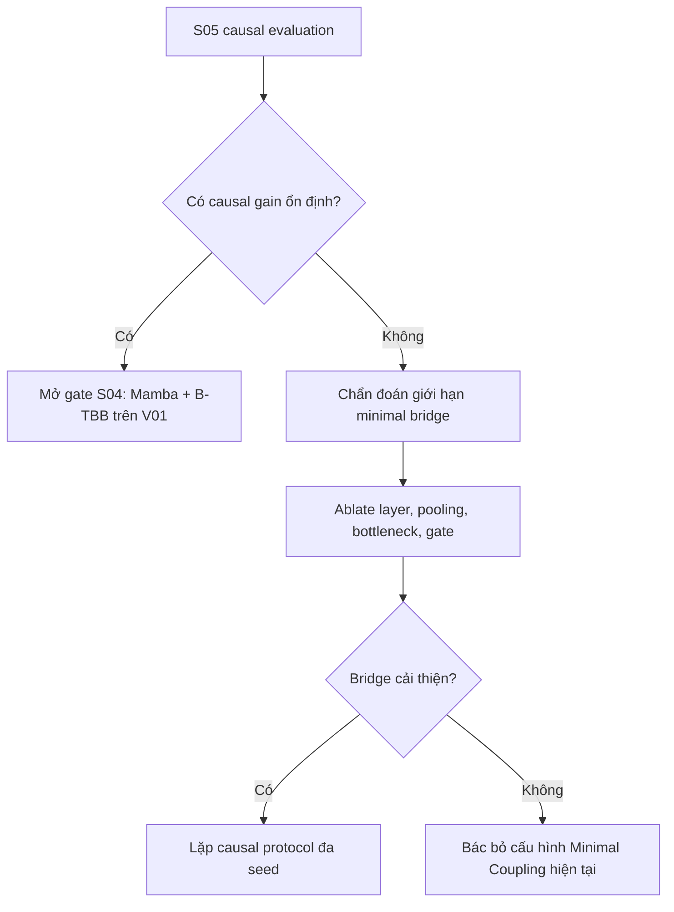

# Báo cáo nghiên cứu tích hợp CoSpec-SSB

## Từ Minimal Latent Coupling trên GSM8K đến Forced-Cooperation Benchmark và quyết định Gate G01

**Phạm vi:** S01, S02, S03, V01 và G01  
**Trạng thái:** Hoàn thành giai đoạn kiểm chứng nguyên lý ban đầu  
**Ngày tổng hợp:** 19/07/2026  
**Mô hình chính:** `Qwen/Qwen2.5-1.5B-Instruct`  
**Hướng tiếp theo:** S05 — Bridge-Only Minimal Coupling trên V01  

---

## Tóm tắt

Nghiên cứu này khảo sát khả năng thiết lập một kênh giao tiếp latent có thể học được giữa hai mô hình ngôn ngữ độc lập, hướng tới kiến trúc CoSpec-SSB (*Selective State-Space Communication Bus*). Thay vì triển khai ngay một bus Mamba phức tạp, giai đoạn đầu sử dụng **Minimal Latent Coupling**: hidden state của Agent A tại layer 14 được mean-pool, chiếu tuyến tính xuống vector $z\in\mathbb{R}^{64}$, rồi tiêm có gate vào hidden state layer 14 của Agent B. Chiến lược này nhằm trả lời trước hai câu hỏi nền tảng: pipeline latent có vận hành ổn định hay không, và Agent B có thực sự sử dụng thông tin mẫu-cụ-thể từ Agent A hay không.

S01 xác nhận hạ tầng hoạt động sau khi phát hiện adapter import ban đầu không hoàn chỉnh và retrain lại baseline. S02 cho thấy pipeline train ổn định về mặt kỹ thuật, nhưng accuracy trên 100 mẫu GSM8K chỉ đạt **0.37**, thấp hơn Agent B độc lập (**0.61**) và text-based A→B baseline D11.0 (**0.68**). Vì accuracy đơn thuần không chứng minh quan hệ nhân quả, S03 thực hiện matched, whole-dataset shuffle, zero, Gaussian noise và zero-trained control. Kết quả matched và shuffled cùng đạt **0.37**; zero và noise đạt **0.38**; zero-trained control đạt **0.43**. Các paired bootstrap interval đều không cho thấy lợi ích của message đúng cặp. Verdict là **`NO_CAUSAL_DEPENDENCY`**, do đó gate nâng cấp trực tiếp lên Mamba S04 được giữ ở trạng thái **HOLD**.

Song song, V01 xây dựng benchmark CSP split-view với 800/100/100 mẫu train/dev/test. Mỗi view riêng lẻ thiếu một nửa phép nối cần thiết để tìm vị trí của entity đích. Dataset v01.2 pass kiểm tra nghiệm duy nhất, cân bằng lớp, không trùng split và leakage probe. Qwen2.5-1.5B đạt mức chance trên từng view nhưng đạt **0.89** khi thấy full problem, cung cấp bằng chứng thực nghiệm rằng benchmark thực sự tạo áp lực cộng tác cho mô hình được kiểm tra.

Từ hai track, G01 kết luận chưa có cơ sở để quy kết kết quả âm tính cho riêng kiến trúc latent. GSM8K không buộc Agent B sử dụng A, trong khi quy trình retrain B ở S02 tự nó cũng làm suy giảm năng lực. Bước tiếp theo hợp lý nhất là **S05: giữ nguyên Minimal Coupling tuyến tính, chuyển sang V01, đóng băng hoàn toàn cả A và B, chỉ train bridge**. Thiết kế này đồng thời loại ceiling effect và confound do fine-tune receiver, trước khi cân nhắc tăng độ phức tạp lên Mamba.

---

## 1. Bối cảnh và động cơ nghiên cứu

### 1.1. Vấn đề nghiên cứu

Các hệ nhiều LLM thường giao tiếp qua văn bản. Cách tiếp cận này dễ triển khai và dễ diễn giải, nhưng phải chuyển tri thức nội bộ thành token rồi để mô hình nhận giải mã lại. CoSpec-SSB đặt câu hỏi liệu hai LLM có thể trao đổi trực tiếp qua một trạng thái latent nén, có khả năng học và cuối cùng có tính chọn lọc theo thời gian hay không.

Mục tiêu dài hạn là một bus dựa trên state-space model, trong đó Agent A tạo tín hiệu latent và Agent B truy xuất tín hiệu đó tại một layer trung gian. Tuy nhiên, xây Mamba bus ngay từ đầu sẽ làm tăng đáng kể số biến thực nghiệm. Nếu kết quả âm tính, khó xác định nguyên nhân nằm ở hook, gradient, receiver, dataset, chế độ training hay chính Mamba.

Vì vậy, nghiên cứu áp dụng nguyên tắc **kiểm chứng cơ chế tối thiểu trước khi tăng độ phức tạp kiến trúc**.

### 1.2. Vì sao triển khai hai track song song

Hai track được thiết kế để trả lời hai nhóm câu hỏi khác nhau:

| Track | Mục đích | Câu hỏi chính |
| --- | --- | --- |
| S01–S03 | Kiểm tra kỹ thuật và quan hệ nhân quả của latent coupling trên GSM8K | Pipeline có train được không? B có dùng $z$ không? |
| V01 | Xây benchmark buộc hợp tác và kiểm tra leakage | Từng view có thật sự không đủ thông tin, trong khi full input vẫn giải được không? |

GSM8K phù hợp để kiểm tra nhanh vì code, adapter và baseline đã tồn tại. Tuy nhiên, cả A và B đều thấy toàn bộ bài toán, nên B có thể tự giải mà không cần message. V01 giải quyết đúng điểm yếu này bằng cách tách thông tin thành hai view bổ sung lẫn nhau.

### 1.3. Câu hỏi nghiên cứu của giai đoạn

- **RQ1 — Technical viability:** Có thể trích xuất, nén, truyền và tiêm hidden state giữa hai Qwen2.5-1.5B mà gradient vẫn ổn định hay không?
- **RQ2 — Causal dependency:** Output của Agent B có phụ thuộc vào message $z$ đúng cặp mẫu hay không?
- **RQ3 — Communication utility:** Message latent có cải thiện chất lượng so với các control hợp lệ hay không?
- **RQ4 — Dataset validity:** V01 có tạo forced cooperation mà không lộ shortcut bề mặt hay không?
- **RQ5 — Gate decision:** Nên nâng cấp ngay lên Mamba, hay cần một thí nghiệm tuyến tính sạch hơn trước?

---

## 2. Tổng quan quy trình thực nghiệm



Logic của quy trình là tách ba điều kiện cần:

1. **Cơ chế phải chạy được** — được kiểm tra ở S01–S02.
2. **Message phải có tác động nhân quả** — được kiểm tra ở S03.
3. **Nhiệm vụ phải tạo nhu cầu giao tiếp** — được kiểm tra ở V01.

Chỉ accuracy của mô hình coupled là không đủ để thỏa cả ba điều kiện.

---

## 3. S01 — Hạ tầng và khả năng vận hành

### 3.1. Audit adapter

Adapter D11.0 import ban đầu bị cắt cụt hoặc không hoàn chỉnh, nên không thể được xem là artifact đáng tin cậy cho thí nghiệm mới. Baseline adapters được retrain trong repo CoSpec-SSB và lưu riêng dưới `outputs/S01_baseline_retrained/adapters`.

Quyết định retrain thay vì âm thầm tiếp tục với artifact lỗi là cần thiết vì:

- một adapter không đầy đủ có thể load lỗi hoặc tạo kết quả không tái lập;
- mọi kết luận causal sau đó phụ thuộc vào việc A và B có checkpoint xác định rõ;
- việc lưu adapter retrain ở namespace riêng bảo toàn provenance và tránh nhầm với bản import.

### 3.2. Hook và gradient path

S01 xây utility để:

- lấy decoder layer theo `model.config`, không hardcode cấu trúc model;
- trích hidden state của Agent A bằng forward hook;
- thay đổi input hidden state của Agent B bằng forward pre-hook;
- hỗ trợ chạy tuần tự khi cần giảm VRAM.

Các hook xử lý được cả input 2D/3D đúng device. Trong S02, loss backward thành công và gradient của bridge/gate tồn tại, xác nhận đường truyền differentiable từ loss của B về module giao tiếp.

### 3.3. Kết luận S01

S01 trả lời dương tính cho phần kỹ thuật của RQ1: **pipeline latent có thể được cài đặt và tối ưu ổn định trên hạ tầng hiện có**. Kết luận này chỉ nói về khả năng vận hành, chưa nói message có hữu ích hay được sử dụng.

---

## 4. S02 — Minimal Latent Coupling trên GSM8K

### 4.1. Kiến trúc

Agent A và Agent B đều dựa trên `Qwen2.5-1.5B-Instruct`. Agent A được đóng băng; Agent B được khởi tạo từ baseline retrain và tiếp tục train bằng LoRA. Tại layer $l=14$, hidden state của A được nén thành một vector duy nhất:

\[
\bar{h}_A=\frac{1}{T_A}\sum_{t=1}^{T_A}h_{A,t}^{(14)},
\qquad
z=W_{down}\bar{h}_A,
\qquad z\in\mathbb{R}^{64}.
\]

Message được chiếu ngược lên không gian hidden của B:

\[
z_{proj}=W_{up}z.
\]

Tại mỗi vị trí token của B, gate học mức injection:

\[
g_t=\sigma\left(W_g[h_{B,t};z_{proj}]\right),
\qquad
h'_{B,t}=h_{B,t}+g_t\odot z_{proj}.
\]

### 4.2. Lý do cho các lựa chọn thiết kế

| Lựa chọn | Giá trị | Lý do |
| --- | ---: | --- |
| Layer trích/tiêm | 14 | Layer giữa stack, cân bằng biểu diễn ngữ nghĩa và khả năng tác động lên các layer sau |
| Bottleneck | 64 | Cố ý nhỏ để kiểm tra cơ chế nén tối thiểu và giảm số tham số |
| Pooling | Mean pooling | Baseline đơn giản, ít biến thiết kế, phù hợp kiểm chứng pipeline |
| Agent A | Frozen | Giảm VRAM và cô lập việc học vào bridge/receiver |
| Agent B | LoRA train tiếp | Cho receiver cơ hội thích nghi với phân phối hidden state được tiêm |

Đây là baseline latent tĩnh, không phải SSB đầy đủ. Nó không có memory, slot pooling hay selective state-space dynamics.

### 4.3. Quá trình training

Training sử dụng 180 mẫu và khoảng 23 optimization steps. Loss giảm ổn định từ **0.5915** xuống **0.5525**, không xuất hiện NaN hoặc gradient overflow. Điều này xác nhận module có thể tối ưu, nhưng loss giảm không đồng nghĩa với communication được học.

### 4.4. Kết quả

Đánh giá dùng 100 mẫu đầu tiên của GSM8K test split với seed 42.

| Hệ thống | Accuracy | Chênh lệch so với B-alone |
| --- | ---: | ---: |
| Agent A alone, baseline retrain | 0.49 | -0.12 |
| Agent B alone, baseline retrain | 0.61 | 0.00 |
| D11.0 text A→B | 0.68 | +0.07 |
| D12.0 majority vote | 0.50 | -0.11 |
| S02 Minimal Latent Coupling | **0.37** | **-0.24** |

### 4.5. Diễn giải ban đầu

S02 cho thấy ba điều:

1. Pipeline hoạt động về mặt kỹ thuật.
2. Cấu hình coupled hiện tại không cải thiện GSM8K.
3. Accuracy 0.37 tự nó chưa cho biết $z$ gây hại, bị bỏ qua, hay kết quả giảm do Agent B được train thêm trên tập nhỏ.

So sánh trực tiếp S02 với B-alone bị confound vì hai hệ thống không có cùng lịch sử training. Do đó, kết luận causal được hoãn đến S03.

---

## 5. S03 — Kiểm định quan hệ nhân quả của latent message

### 5.1. Thiết kế can thiệp

S03 giữ cố định sample, checkpoint, prompt, decoding và evaluation settings; chỉ thay đổi message truyền vào B.

| Điều kiện | Can thiệp | Câu hỏi được kiểm tra |
| --- | --- | --- |
| Matched | Mẫu $i$ nhận $z_i$ | Hiệu năng coupled gốc |
| Shuffled | Mẫu $i$ nhận $z_j, j\ne i$ bằng derangement toàn dataset | B có dùng thông tin mẫu-cụ-thể không? |
| Zero inference | Thay $z_i$ bằng vector 0 tại eval | B có phụ thuộc vào sự tồn tại của message không? |
| Noise | Thay bằng Gaussian có mean/std thực nghiệm | B có phản ứng với nội dung hay chỉ với nhiễu/phân phối? |
| Zero-trained control | Train cùng budget nhưng luôn dùng $z=0$ | Tách lợi ích message khỏi tác động của extra training |

Các delta chính:

\[
\Delta_{shuffle}=Acc_{matched}-Acc_{shuffled},
\]

\[
\Delta_{zero}=Acc_{matched}-Acc_{zero},
\]

\[
\Delta_{control}=Acc_{matched}-Acc_{zero\text{-}trained}.
\]

Paired bootstrap 95% CI được tính trên cùng 100 test examples.

### 5.2. Kết quả

| Đại lượng | Accuracy hoặc delta | Paired 95% CI |
| --- | ---: | --- |
| Matched | 0.37 | — |
| Shuffled | 0.37 | — |
| Zero inference | 0.38 | — |
| Noise | 0.38 | — |
| Zero-trained control | 0.43 | — |
| $\Delta_{shuffle}$ | 0.00 | [-0.03, 0.03] |
| $\Delta_{zero}$ | -0.01 | [-0.06, 0.04] |
| $\Delta_{noise}$ | -0.01 | [-0.06, 0.03] |
| $\Delta_{control}$ | -0.06 | [-0.14, 0.02] |

### 5.3. Diễn giải theo từng câu hỏi causal

**Q1 — Sample-specific dependency:** Không có bằng chứng. Shuffling toàn dataset không làm thay đổi accuracy; $\Delta_{shuffle}=0.00$.

**Q2 — Message dependency:** Không có bằng chứng. Zero và noise không làm giảm accuracy; point estimate thậm chí cao hơn matched một điểm phần trăm.

**Q3 — Communication utility sau khi kiểm soát extra training:** Không có bằng chứng. Zero-trained control cao hơn matched 0.06 ở point estimate, dù CI còn chứa 0.

Kết luận chính xác không phải “$z$ chắc chắn không chứa thông tin”, mà là: **trong end-to-end system và protocol hiện tại, output của B không biểu hiện sự phụ thuộc nhân quả đo được vào nội dung $z$**.

### 5.4. Phát hiện về training regime

Zero-trained control đạt 0.43, vẫn thấp hơn B-alone 0.61 tới 18 điểm phần trăm dù message bị ép bằng 0. Vì vậy, một phần đáng kể suy giảm không thể quy cho latent injection. Kết quả này chỉ ra confound độc lập: quy trình `merge_and_unload` + fresh LoRA, cùng lượng dữ liệu nhỏ và số step hạn chế, có thể làm suy giảm năng lực gốc của receiver.

### 5.5. Verdict S03

```yaml
verdict: NO_CAUSAL_DEPENDENCY
s04_gate: HOLD
acc_matched: 0.3700
acc_shuffled: 0.3700
acc_zero_inference: 0.3800
acc_noise: 0.3800
acc_zero_trained_control: 0.4300
delta_shuffle: 0.0000
delta_zero: -0.0100
delta_matched_vs_zero_control: -0.0600
```

S03 trả lời âm tính cho RQ2 và RQ3 ở cấu hình hiện tại. Kết quả không hỗ trợ nâng cấp trực tiếp lên Mamba trên GSM8K.

---

## 6. V01 — Benchmark CSP Split-View buộc hợp tác

### 6.1. Vì sao cần benchmark mới

Trên GSM8K, Agent B thấy toàn bộ đề và đạt 0.61 khi hoạt động độc lập. Trong bối cảnh đó, gradient có thể được tối ưu mà không cần học cách đọc message từ A. Đây là thiếu sót về áp lực nhiệm vụ, không nhất thiết là thất bại kiến trúc.

V01 được thiết kế để bảo đảm từng view thiếu đúng một phép nối cần thiết, trong khi hai view ghép lại tạo một bài toán dễ giải và có nghiệm duy nhất.

### 6.2. Cấu trúc bài toán

Mỗi instance có:

- $N=4$ entity ẩn danh;
- $N=4$ link ID ẩn danh;
- bốn slot có thứ tự;
- một song ánh `entity -> link`;
- một song ánh `slot -> link`;
- một query yêu cầu slot của entity đích.

Answer space cố định là `SLOT_0` đến `SLOT_3`, nên random accuracy bằng 0.25.

| View | Thông tin có sẵn | Thông tin bị thiếu |
| --- | --- | --- |
| View A | Mapping entity → link và entity đích | Thứ tự link theo slot |
| View B | Thứ tự link theo slot và tên entity đích | Mapping entity → link |
| Full problem | Cả hai nửa | Không thiếu |

Để giải, hệ thống phải lấy link của entity đích từ View A rồi tìm vị trí link đó trong View B.

### 6.3. Kiểm soát leakage và nghiệm duy nhất

Generator v01.2 sử dụng các combinatorial block 16 mẫu: bốn entity-link mappings được kết hợp với bốn slot orders. Trong mỗi block đầy đủ, mỗi A-view và B-view lặp lại xuất hiện một lần với từng answer class. Thiết kế này cân bằng shortcut theo cấu trúc thay vì lọc test cho đến khi probe pass.

Validator thực hiện:

- giải lại CSP bằng enumeration độc lập;
- xác nhận đúng một nghiệm và gold nhất quán;
- kiểm tra mỗi partial view vẫn cho phép mọi target class;
- tái tạo formatter từ seed;
- kiểm tra direct answer/metadata leakage;
- kiểm tra duplicate, canonical hash và overlap giữa split;
- kiểm tra cân bằng lớp.

Hai phiên bản phát triển v01 và v01.1 từng fail threshold nghiêm ngặt vì rejection sampling để lại tương quan giữa bề mặt và label. Chúng được thay thế toàn bộ bởi v01.2; không có thao tác lọc riêng test rows để làm đẹp kết quả.

### 6.4. Quy mô dataset

| Split | Số mẫu | SLOT_0 | SLOT_1 | SLOT_2 | SLOT_3 |
| --- | ---: | ---: | ---: | ---: | ---: |
| Train | 800 | 200 | 200 | 200 | 200 |
| Dev | 100 | 25 | 25 | 25 | 25 |
| Test | 100 | 25 | 25 | 25 | 25 |

**Dataset validation:** `PASS`  
**Generator version:** `v01.2`  
**Generator SHA-256:** `7acf00382fe479541fbc31a8cfeba880097ebcdfc13826fd5efdb25a82013e8c`

### 6.5. Linear leakage probes

Word- và character-level TF-IDF được kết hợp với multinomial logistic regression. Vectorizer chỉ fit trên train, tuning hạn chế trên dev và test được đánh giá một lần.

| Probe | Accuracy | Macro-F1 | Bootstrap 95% CI | Gate threshold |
| --- | ---: | ---: | --- | ---: |
| View A | 0.25 | 0.10 | [0.17, 0.34] | 0.28 |
| View B | 0.25 | 0.10 | [0.17, 0.34] | 0.28 |

Cả hai point estimate đều bằng random baseline và thấp hơn threshold 0.28. Tuy nhiên, full-problem linear probe cũng chỉ đạt 0.25. Điều này cho thấy linear probe quá yếu để giải phép nối quan hệ, vì vậy kết quả pass chỉ loại được một nhóm shortcut bề mặt; nó không đủ để chứng minh forced cooperation một mình.

### 6.6. Neural baseline với Qwen2.5-1.5B

Một Qwen2.5-1.5B-Instruct frozen được đánh giá zero-shot với greedy decoding, không dùng mẫu V01 để train hoặc chọn prompt.

| Điều kiện | N | Raw accuracy | Macro-F1 | Parse rate | Accuracy trên phần parse được |
| --- | ---: | ---: | ---: | ---: | ---: |
| View A | 100 | 0.25 | 0.2441 | 1.00 | 0.25 |
| View B | 100 | 0.14 | 0.1273 | 0.56 | 0.25 |
| Full problem | 100 | **0.89** | 0.8898 | 1.00 | 0.89 |

View B có raw accuracy 0.14 chủ yếu do 44% response không parse được. Trong 56 response parse được, 14 câu đúng, tương ứng accuracy 0.25. Vì vậy, kết quả phản ánh lỗi format/abstention chứ không phải tri thức dưới chance.

Chênh lệch giữa full problem và partial view tốt nhất là **+0.64**. Kết hợp với unique-solution validation và probe bề mặt, đây là bằng chứng mạnh rằng V01 tạo forced cooperation cho model family và protocol đã kiểm tra.

### 6.7. Gate V01

```yaml
generator_version: v01.2
dataset_validation: PASS
linear_leakage_probe: PASS
neural_partial_view_gate: PASS
full_problem_sanity: PASS
gate: PASS
```

---

## 7. Tổng hợp bằng chứng giữa hai track

### 7.1. Những gì đã được chứng minh

| Kết luận | Bằng chứng | Mức độ hỗ trợ |
| --- | --- | --- |
| Latent bridge có thể cài đặt và train | Hook, backward, loss ổn định ở S01–S02 | Mạnh |
| S02 không cải thiện GSM8K | 0.37 so với B-alone 0.61 | Mạnh |
| B không dùng message đúng cặp ở S03 | Matched = shuffled; zero/noise không giảm | Mạnh trong protocol hiện tại |
| Extra training của B là một confound | Zero-trained control 0.43 < B-alone 0.61 | Mạnh ở point estimate về degradation |
| V01 không có shortcut bề mặt tuyến tính rõ | Probe A/B = 0.25 | Hỗ trợ, nhưng probe yếu |
| V01 buộc Qwen được kiểm tra phải kết hợp hai view | Partial ≈ chance, full = 0.89 | Mạnh cho model/protocol đã thử |

### 7.2. Những gì chưa được chứng minh

- Chưa biết Minimal Coupling có học communication trên V01 hay không.
- Chưa biết mean pooling, layer 14 hay bottleneck 64 là giới hạn chính.
- Chưa có bằng chứng rằng Mamba tốt hơn linear bridge hoặc Transformer bottleneck.
- Chưa đo training-seed variance; S02/S03 mới có một training seed.
- Chưa chứng minh forced cooperation cho mọi LLM hoặc mọi prompting strategy.
- Chưa đánh giá generalization ngoài template/generator V01.

### 7.3. Ba giả thuyết giải thích kết quả âm tính trên GSM8K

**H1 — Thiếu áp lực giao tiếp.** B-alone đã đạt 0.61 vì thấy full problem. Gradient không buộc hệ thống sử dụng $z$.

**H2 — Training regime degradation.** Ngay cả zero-trained control cũng giảm xuống 0.43. Việc fine-tune B trên tập nhỏ có thể gây forgetting hoặc distribution shift.

**H3 — Minimal bridge thiếu khả năng biểu đạt.** Mean pooling loại bỏ trật tự token; bottleneck 64 có thể quá nhỏ; một vector toàn cục tiêm tại duy nhất layer 14 có thể không phù hợp với biểu diễn của B.

S02/S03 không tách được hoàn toàn H1 và H2 khỏi H3. Vì vậy, nâng cấp thẳng lên Mamba sẽ thêm biến kiến trúc trong khi nguyên nhân nền chưa được cô lập.

---

## 8. Quyết định Gate G01

### 8.1. Không triển khai S04 Mamba ở thời điểm hiện tại

```yaml
s04_mamba_gate: HOLD
```

Quyết định HOLD không có nghĩa Mamba bị bác bỏ. Nó có nghĩa bằng chứng hiện tại chưa đủ để biện minh cho việc tăng độ phức tạp. Nếu S04 được chạy ngay trên cùng dataset và training regime, kết quả dương hoặc âm đều tiếp tục bị confound bởi H1 và H2.

### 8.2. Tiến hành S05 Bridge-Only Minimal Coupling trên V01

```yaml
s05_gate: GO
dataset_track: V01
dataset_status: PASS
next_experiment: S05_bridge_only_minimal_coupling_v01
```

S05 giữ nguyên kiến trúc tuyến tính cơ bản để tạo so sánh trực tiếp, nhưng thay đổi hai yếu tố môi trường:

1. **Chuyển từ GSM8K sang V01:** từng receiver view chỉ đạt mức chance, nên hệ thống có áp lực thực sự phải nhận thông tin từ sender.
2. **Đóng băng cả Agent A và Agent B:** optimizer chỉ cập nhật bridge/gate, loại bỏ khả năng năng lực B giảm do một vòng LoRA mới.

Đây là thay đổi tối thiểu có khả năng phân biệt H1/H2 với H3.

---

## 9. Kế hoạch nghiên cứu tiếp theo: S05

### 9.1. Mục tiêu

S05 trả lời một câu hỏi duy nhất:

> Khi nhiệm vụ thật sự yêu cầu kết hợp hai view và năng lực gốc của cả A/B được giữ nguyên, một bridge tuyến tính có học được message latent hữu ích hay không?

### 9.2. Thiết kế đề xuất

| Thành phần | Thiết kế S05 |
| --- | --- |
| Dữ liệu | V01 v01.2, train/dev/test = 800/100/100 |
| Input A | View A: entity → link mappings |
| Input B | View B: ordered link sequence |
| Agent A | Frozen hoàn toàn |
| Agent B | Frozen hoàn toàn |
| Trainable | Write encoder, up-projection và coupling gate |
| Layer | 14, giữ như S02 |
| Bottleneck | 64, giữ như S02 |
| Objective | Cross-entropy cho answer class `SLOT_0...SLOT_3` |
| Primary metric | Test accuracy và macro-F1 |
| Causal tests | Matched, shuffled, zero, noise |

Điểm kỹ thuật quan trọng: dù weights của B bị đóng băng, forward của B **không được đặt trong `torch.no_grad()`**, vì gradient vẫn phải truyền qua computation graph của B về injected bridge activations. Chỉ parameters của B có `requires_grad=False`.

### 9.3. Baseline bắt buộc

- View A alone.
- View B alone, báo cả raw accuracy và parsed accuracy.
- Full problem frozen-model ceiling.
- Matched bridge.
- Shuffled message.
- Zero message.
- Empirical Gaussian noise.

Nếu tài nguyên cho phép, text A→B trên cùng split nên được thêm như baseline communication dễ diễn giải, nhưng không được dùng để thay thế causal controls.

### 9.4. Tiêu chí quyết định đề xuất cho S05

Một gate dương tính nên đồng thời yêu cầu:

1. Matched accuracy cao hơn chance/best single-view một khoảng có ý nghĩa.
2. Matched cao hơn shuffled và zero với paired 95% CI ủng hộ delta dương.
3. Gain tái lập qua nhiều training seeds trước khi đưa ra claim mạnh.

Ngưỡng vận hành ban đầu có thể giữ nhất quán với protocol S03:

\[
\Delta_{shuffle}>0.10 \quad \text{hoặc} \quad \Delta_{zero}>0.10,
\]

nhưng verdict cuối không nên dựa duy nhất vào point estimate. Cần xem CI, absolute accuracy và stability giữa seeds.

### 9.5. Nhánh quyết định sau S05



Nếu S05 pass, bước kế tiếp hợp lý là so sánh **Mamba SSB với Transformer Bottleneck (B-TBB)** dưới cùng $K$, $d_{bus}$, training budget và input visibility. Nếu S05 fail, cần xác định giới hạn nằm ở mean pooling, vị trí layer, bottleneck hay injection trước khi cho rằng Mamba sẽ tự động giải quyết vấn đề.

---

## 10. Rủi ro, giới hạn và biện pháp giảm thiểu

| Giới hạn | Ảnh hưởng đến kết luận | Bước xử lý |
| --- | --- | --- |
| S02/S03 chỉ có một training seed | Chưa đo variance do optimization | Chạy tối thiểu 3–5 seeds ở thí nghiệm quyết định |
| GSM8K eval chỉ 100 mẫu | CI còn rộng, sai số lấy mẫu đáng kể | Mở rộng eval sau khi protocol ổn định |
| S02 chỉ train 180 mẫu/23 steps | Có thể underfit bridge và làm LoRA thiếu ổn định | S05 dùng toàn bộ 800 train mẫu, theo dõi train/dev curves |
| V01 là synthetic task đơn giản | Gain có thể phụ thuộc template | Thêm held-out surface templates và OOD generator sau proof-of-concept |
| Linear full-problem probe cũng ở chance | Probe bề mặt không đo được relational reasoning | Dùng neural A-only/B-only/full baselines làm validation chính |
| View B có parse rate 0.56 | Raw accuracy trộn lẫn reasoning và format failure | Báo cả raw/parsed; chuẩn hóa answer parser/prompt trước S05 |
| Frozen B có thể không thích nghi với latent injection | S05 fail có thể do interface mismatch | Sau S05, ablate normalization/gate/layer trước khi tăng model complexity |
| So sánh GSM8K và V01 trực tiếp không hợp lệ | Hai task có answer space và độ khó khác nhau | Chỉ so causal pattern, không so raw accuracy xuyên dataset |

---

## 11. Kết luận

Giai đoạn S01–S03 và V01 đã đạt mục tiêu quan trọng nhất của một nghiên cứu thăm dò: biến một ý tưởng kiến trúc rộng thành các giả thuyết có thể bác bỏ và các gate có thể đo lường.

S01 chứng minh latent communication pipeline khả thi về kỹ thuật. S02 cho thấy cấu hình Minimal Coupling hiện tại không mang lại lợi ích trên GSM8K. S03 đi xa hơn accuracy bằng can thiệp nhân quả và xác nhận rằng Agent B không sử dụng message mẫu-cụ-thể trong protocol này. Đồng thời, zero-trained control phát hiện một confound lớn từ chính chế độ retrain B. V01 sau đó cung cấp một benchmark sạch hơn: từng view ở mức chance, full problem đạt 0.89, dataset cân bằng và pass validation/leakage gates.

Do đó, kết luận khoa học phù hợp không phải “latent communication thất bại” và cũng chưa phải “cần Mamba mạnh hơn”. Kết luận là:

> Minimal Latent Coupling chưa tạo causal communication trên GSM8K dưới training regime S02; tuy nhiên, dataset không tạo áp lực cộng tác và receiver fine-tuning gây suy giảm độc lập. Cần kiểm tra lại cùng bridge trên V01 với A/B frozen trước khi thay đổi kiến trúc.

G01 vì vậy đưa ra quyết định bảo thủ nhưng có thông tin cao: **giữ S04 ở trạng thái HOLD và triển khai S05 bridge-only trên V01**. Đây là thí nghiệm tiếp theo có khả năng giải thích lớn nhất trên mỗi đơn vị compute, đồng thời bảo toàn khả năng diễn giải của mọi kết quả sau đó.

---

## 12. Artifact và khả năng tái lập

Các báo cáo nguồn được sử dụng trong tổng hợp này:

- `S01_S02_ssb_prototype_report.md`
- `S02_minimal_coupling_results.md`
- `S03_causal_diagnostic_verdict.md`
- `V01_csp_schema_design.md`
- `V01_split_view_dataset_results.md`
- `V01_neural_baseline_results.md`
- `G01_gate_decision_and_next_steps.md`

Trạng thái cuối giai đoạn:

```yaml
completed:
  - S01_infrastructure
  - S02_minimal_coupling_gsm8k
  - S03_causal_diagnostic
  - V01_split_view_dataset
s03_verdict: NO_CAUSAL_DEPENDENCY
v01_gate: PASS
s04_mamba_gate: HOLD
s05_bridge_only_v01_gate: GO
primary_next_question: >-
  Can a bridge-only latent channel learn useful, sample-specific communication
  on V01 when both language models are frozen?
```
